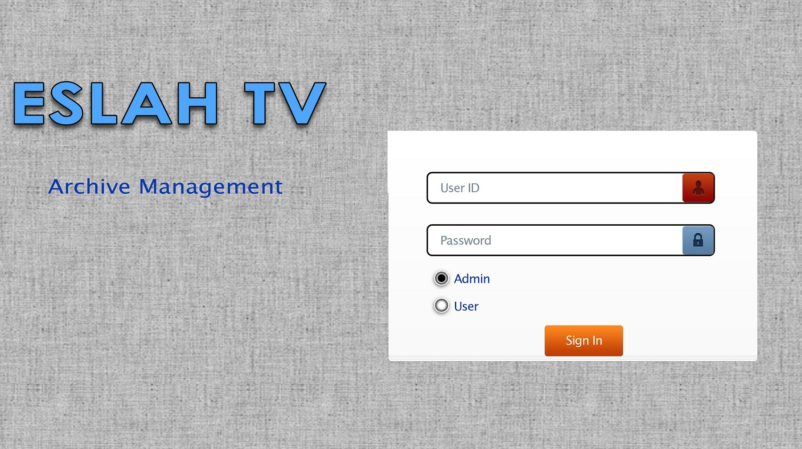
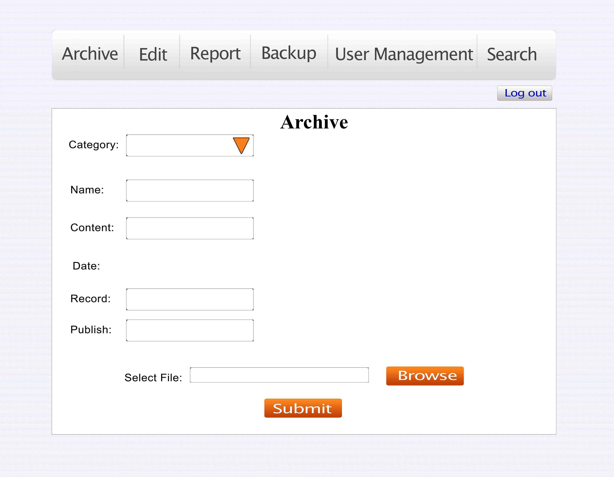
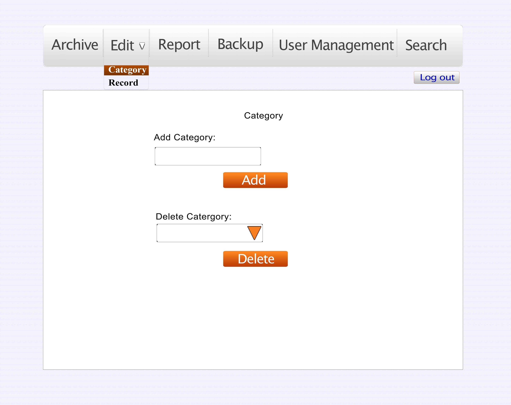
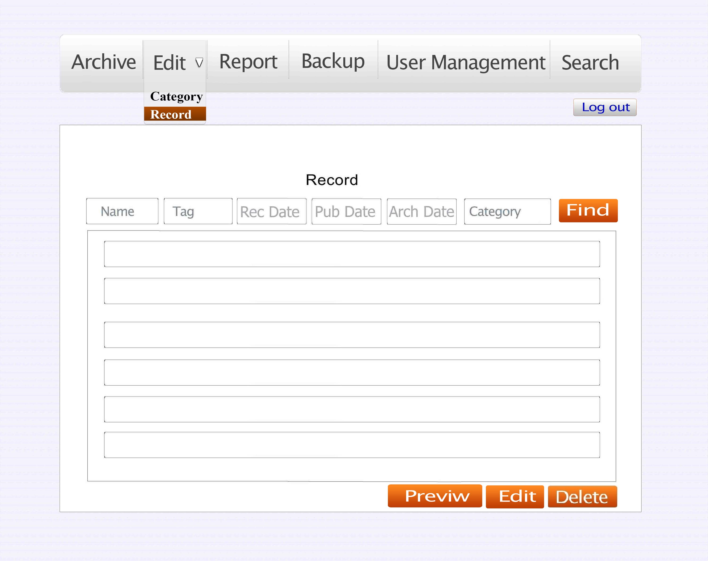
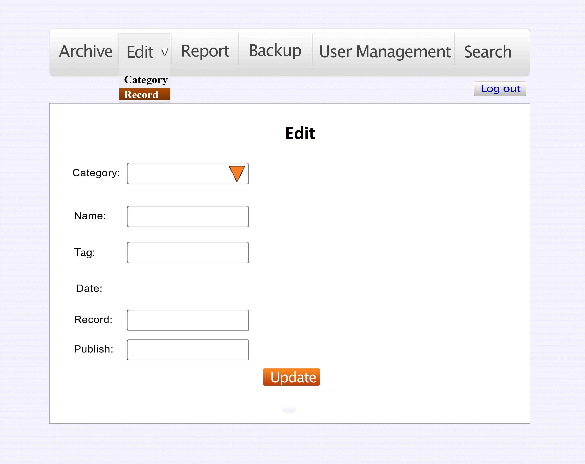
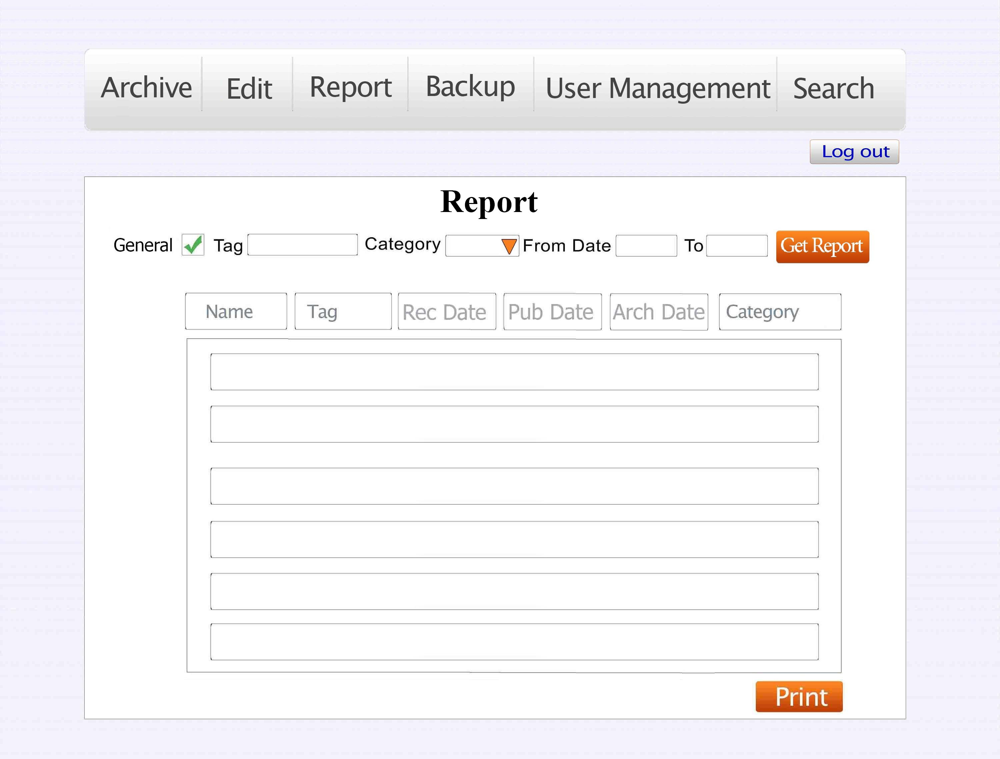
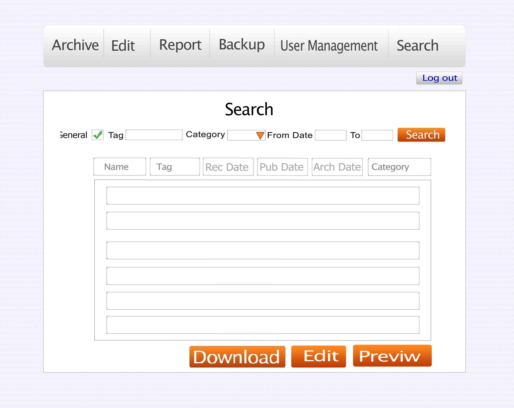
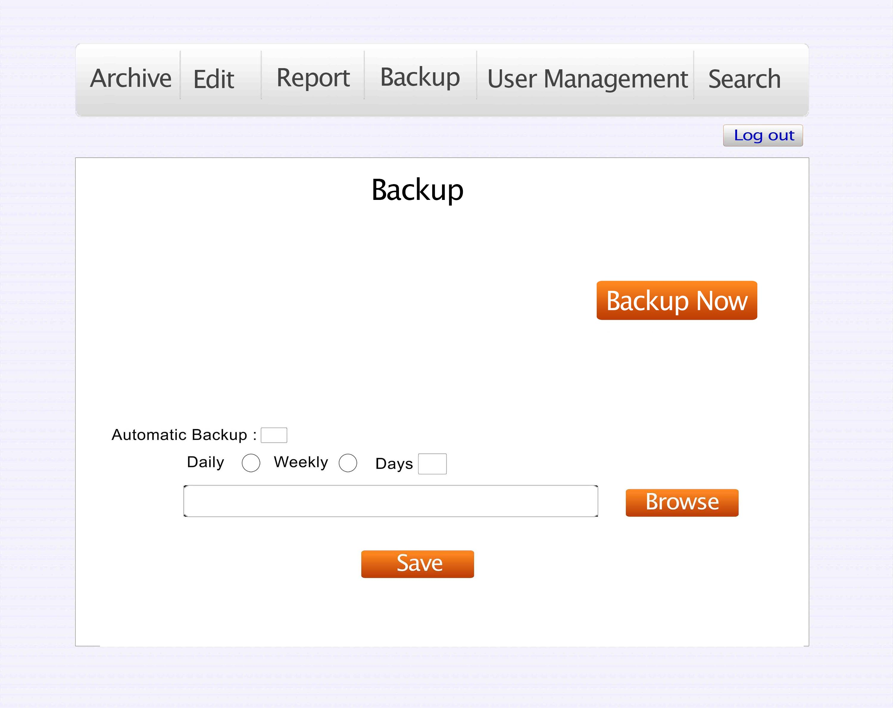
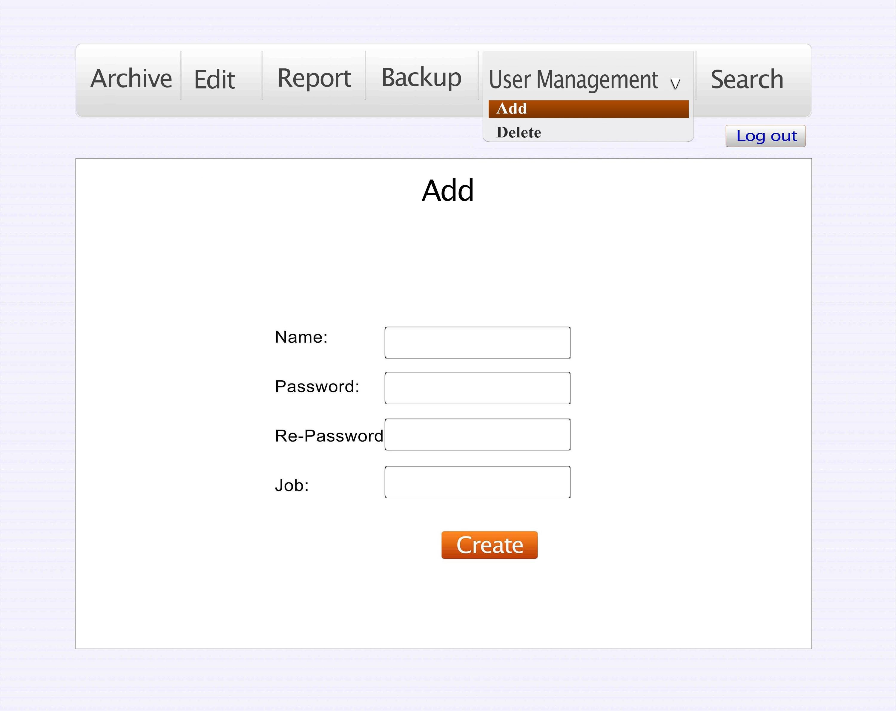
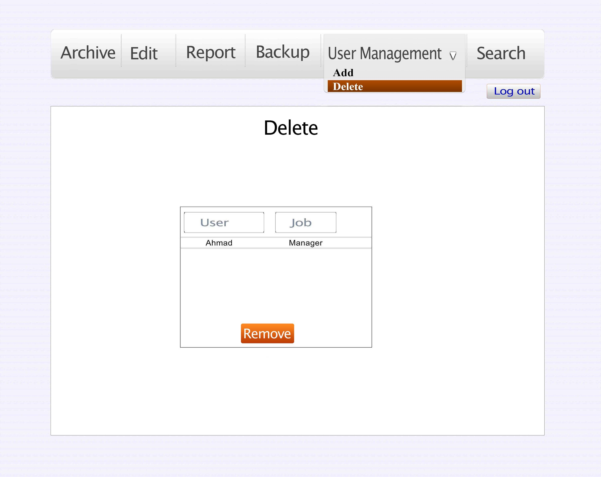

#### 
 786
       
# Full Report 3 

THE ALPHA TEAM PROPOSAL FOR SERVICES
============================================

OVERVIEW
-----------------------------------------
 
The Alpha team is pleased to submit this proposal for services to support Eslaah TV in achieving its goals for improving their data management, Archiving and retrieving Data.

### The Objective ###

The customer's objectives are as following:

* < Need #1: managing data in an efficient  manner>
* < Need #2: Archiving data in an efficient manner >
* < Need #3: Retrieving Data in an easy way>
* < Need #4 :having a report of  data>
* < Need #5:  avoiding Redundancy and duplication in data.>
* < Need #6:Prevention of data-loss (Data Backup)>

### The Opportunity ###

As we have read the clients request for proposal, we recognized that their major goal is to have better data management in their archive. So we would like to grab this opportunity and offer our solution. We would like to summarize the client's goal based on their request for proposal.
 
* < Goal #1: to have a system that  manages their data better>
* < Goal #2: assure quick access to their data>
* < Goal #3: assure data loss prevention>

### The Solution ###

We as a team of experts in our field offer a logical recommendations to this problem. We can develop a software for you that can solve your problems and make efficient use of your time, energy and help you manage your archive better.

We offer these recommendations:

* < Recommendation #1: desktop based TV Archive Manager System>
* < Recommendation #2: web based TV Archive manger System(TAM)>

OUR PROPOSAL
------------------------

We are a team consisting of six people which can help you solve your problems and achieve your goals. Our team has the following members with their specific abilities.

1. Ahmad Jawid (Programmer & Software Engineer)
2. Fardin Hakimi (Software Engineer)
3. Ghazalle Zaheer (Database Designer)
4. Jalil Ahmad Fazely (Database Designer)
5. Aalem Daneshyar (Programmer)
6. Shah Agha (Programmer)

 We strongly recommend you the web based TV archive manger. Because it has the following advantages:

* Multiuser access to data.
* Better data management
* Accessing data over local network
* Ease of retrieving data
* Saves time and energy
* Better security over desktop based system.

 If you continue using the current way of archiving and managing your data, you are likely to face the following problems:

* Losing track of data
* High rate  of Data duplication
* High rate of losing data 
* Mismanagement of data
* Waste of time and energy
* Too much load of data
 
Our solution can enable Eslaah TV to fully realize the benefits of improved productivity throughout the use of our proposed system. Most importantly, we provide the training and support for this new solution.

### Rationale ###

Based on experience of other televisions in various parts of the world, traditional managing and archiving data is not a good idea. It is better to have a specific software to able to manage and archive data in an efficient manner.

### Execution Strategy ###

Our execution strategy incorporates proven methodologies, extremely qualified personnel, and a highly responsive approach to managing deliverables. Following is a description of our project methods, including how the project will be developed.

We will use the agile development method, and we will use two iterations to complete the whole project.

Iteration 1: 

* Archiving data capability
* Managing data capability

Iteration 2: 

* Quick access to data( retrieving capability)
* Having a report of data

### Project Deliverables ###

Following is a complete list of all project deliverables:

<table>
  <tr>
    <th>Deliverable</th><th>Description</th>
  </tr>
  <tr>
    <td>Archiving data </td><td>In categories.</td>
  </tr>
  <tr>
    <td>Archiving the categorized data</td><td>Based on record date, name, contents and a tag.</td>
  </tr>
<tr>
    <td>Report</td><td>Monthly, weekly or daily report of recorded programs.</td>
  </tr>
<tr>
    <td>Searching for a program </td><td>Based on name, date, category, tag or description.</td>
  </tr>
<tr>
    <td>Managing Data</td><td>View, Edit or delete data in different categories.</td>
  </tr>
<tr>
    <td>Redundancy and duplication control</td><td></td>
  </tr>
<tr>
    <td>Prevention of data-loss (Data Backup)</td><td></td>
  </tr>
</table>

### Timeline for Execution ###

Key project dates are outlined below. Dates are best-guess estimates and are subject to change until a contract is executed.

<table>
  <tr>
    <th> Description </th><th> Start Date </th><th> End Date </th> <th>Duration</th>
  </tr>
  <tr>
    <td> Project Start </td><td> 30/3/2013</td><td>22/6/2013</td><td>84 days </td>
  </tr>
  <tr>
    <td> Adding items by category </td><td>11-may-2013</td><td>16-May-2013</td><td>5 days </td>
  </tr>
  <tr>
    <td> Editing or deleting items </td><td>16-May-2013</td><td>23-May-2013</td><td>7 days </td>
  </tr>
  <tr>
    <td> First demo </td><td>11-may-2013</td><td>25-May-2013</td><td>14 days</td>
  </tr>
  <tr>
    <td> Report printing </td><td>25-May-2013</td><td>1-June-2013</td><td>7 days</td>
  </tr>
  <tr>
    <td> Search capability </td><td>1-June-2013</td><td>11-June-2013</td><td>10 days</td>
  </tr>
  <tr>
    <td>Second Demo</td><td>25-May-2013</td><td>19-June-2013</td><td>25 days</td>
  </tr>
  <tr>
    <td> Merge Branch to Release </td><td>19-June-2013</td><td>22-June-2013</td><td>3 days</td>
  </tr>
  <tr>
    <td> Project End </td><td>30/3/2013</td><td>22/6/2013</td><td>84 days</td>
  </tr>

</table>

EXPECTED RESULTS
-------------------------------

We expect our proposed solution to Eslaah TV's requirements to provide the following results:

### Financial Benefits ###

* <Result #1: Requires less resources
* <Result #2: Efficient usage of resources
* <Result #3: Increased productivity

### Technical Benefits ###

* <Result #1: Increased work agility>
* <Result #2: Easy data trouble shooting>
* <Result #3: Easy data management>
* <Result #4: increased work accuracy

CONCLUSION
-------------------------
 
We look forward to working with Eslaah TV and supporting your efforts to improve your Data management, and supporting the software. We are confident that we can meet the challenges ahead, and stand ready to partner with you in delivering an effective solution. 

If you have questions on this proposal, feel free to contact <Ahmad Jawed Jami > at your convenience by email at <AlphaTeam@gmail.com > .We will be in touch with you next week to arrange a follow-up conversation on the proposal.

Thank you for your consideration.

INTERVIEW 
====================

INTERVIEWED BY: THE ALPHA TEAM  

INTERVIEWEE: MR. ABDULLAHI 

To have a better understanding of the project requirements we (The Alpha Team) 
came out to have an interview with the technical staff of the Eslaah TV. 

<b>Fazil:</b> You mentioned that you've worked for different TV stations, did they use any 
database system? 

<b>Technician:</b> Unfortunately no. None of the TV stations, even now, don't have a 
database system. 

<b>Jawid:</b> Do you only want to save the link/address of a file in the database or the file 
itself? 

<b>Technician:</b> No I need just the address of the file but it would be great if there is a 
preview for the specified file in the interface, only if possible. 

<b>Fazel:</b> What about the backup do you need the files to be backed up? 

<b>Technician:</b> Yes of course; we need the files to be automatically backed up, by 
schedule. And the path for backup should be manually specified. 

<b>Technician:</b> What do you think should we have a database for each section (Archive, 
Production, Management, and Editing)? 

<b>Jawid:</b> We have a solution for that, however it's a bit difficult, but we want to create 
web-based application for you to be accessed on the network for each section of your 
station. 

<b>Aalem:</b> how do you archive your files? 

<b>Technician:</b> Based on date, the files are categorized in two parts: Broadcasted and 
Non-broadcasted program. In each folder the category of the files are specified and 
the files are archived. The categorized archived files are then burned on DVDs.
 
<b>Aalem:</b> Even after this system is completed, would you still keep on archiving data on 
DVDs as hard copy? 

<b>Technician:</b> No, this is just a temporary solution to avoid losing data. We want to store 
the data on Hard Drives only. 

We want the programs to be archived and retrieved with/by the following details: 

* Name 
* Dates (Recording, Publishing, Archiving) 
* Category 
* Contents (Tags) 
* Duration of program 

<b>Technician:</b> We also need to have the ability to add a new category. And user/data 
management. 

<b>Jawid:</b> What about the reporting? 

<b>Technician:</b> We do need this ability for the following reports  

* General 
* Specified period of time 
* Categorized 
* Tags 

#Statement of Work for Islaah TV #

The Alpha Team
================================

-------------------------
SOW for Agreement to Perform Consulting Services to Islaah TV
-------------------------
Date: March 30, 2013 
Services Performed By: The Alpha Team 
Services Performed To: Islaah TV 

-------------------------

This statement of work is agreed upon between the Alpha Team and Islaah TV. Only the 
requirements specified in this document are deliverable and will be fulfilled up till the specified 
date. 

Period of Performance 
================================

-------------------------

Start date March 30, 2013, and shall continue through June 22, 2013. 

Scope of Work 
================================

-------------------------
####Problem Statement: ####
Islaah TV uses the traditional/old system of management for archiving data, which is file based 
that will lead to the following problems: 

*  Archiving programs 
*  Categorizing data 
*  Editing or deleting data 
*  Data duplication 
*  Inefficient searching 
*  Waste of time 
*  waste of energy 

#### Our Solutions: ####

We develop an application, which is a database system by the name of Television Archive 
Manager (TAM). 
#### Deliverables: ####
These deliverables are specified according to the client's requirements;
Archiving data by category. 
*  Archiving the categorized data based on their record date, name, contents and a 
tag. 
*  Annually, monthly, weekly or daily report of recorded programs, in print version 
*  Searching for a program based on name, date, category, tag or description. 
*  View, Edit or delete data in different categories. 
*  Redundancy and duplication control 
*  Prevention of data-loss (Data Backup)  

The Alpha Team Responsibilities
================================
-------------------------
The team;s responsibility is to develop the application according to the client's requirements and 
to deliver it on time. To ensure the satisfaction of the client, quality of work and maintenance of 
the software. 

Client Responsibilities 
================================
-------------------------
Having regular meetings with the team and explaining the requirements as clear as possible and 
to support the project till the completion.

Timeline
================================
-------------------------
The project deliverables timeline table: 
<table>
  <tr>
    <th>Deliverable Name</th><th>Delivering Date</th><th>Number of Days</th>
  </tr>
  <tr>
    <td>Adding items by category</td><td>16-May-2013</td><td>5 </td>
  </tr>
 <tr>
    <td>Editing or deleting items </td><td>23-May-2013 </td><td>7</td>
  </tr>
<tr>
    <td>First demo</td><td>25-May-2013</td><td>14</td>
  </tr>
<tr>
    <td>Report printing </td><td>1-June-2013 </td><td>7</td>
  </tr>
<tr>
    <td>Search capability </td><td>11-June-2013</td><td>10</td>
  </tr>
<tr>
    <td>Second Demo </td><td>19-June-2013 </td><td>25</td>
  </tr>
<tr>
    <td>Merge Branch to Release</td><td>22-June-2013 </td><td>40</td>
  </tr>
</table>
Completion Criteria 
================================
-------------------------
* The Alpha Team is to deliver the project on the date specified in the timeline. 
* The specified requirements are to be fulfilled only. 

Assumptions
================================
-------------------------
* The completion of the project may be delayed if new requirements, based on the 
agreement of both parties, are added. 

Functional Requirement Specification
=====================================

1_ As an administrator or user I can access the database from a local/remote system

2_ As a user or administrator I can archive data based on

* Name
* Dates (Recording, Publishing)
* Category
* Contents (Tags)
* Duration of program

3_ As a user or administrator I can search data based on

* Name
* Dates (Recording, Publishing, Archiving)
* Category
* Contents (Tags)
	 
4_ As a user or administrator I can get report based on

* General
* Specified period of time
* Category
* Tags

5_ As an administrator I can back up the data manually or automatically by specified schedule

6_ As an administrator I can manipulate data

* Add a category
* Delete a category
* Edit a file 
* Delete a file
	
7_ As an administrator I can add new authorized users or remove existing ones    

#User Interface
Fig1: Login    
   
Fig2: Archive   
   
Fig3: Edit-1   
   
Fig4: Edit-2   
   
Fig5: Edit-3   
   
Fig6: Report   
   
Fig7: Search   
   
Fig8: Backup   
   
Fig9: User management-add    
   
Fig10: User management-delete   
   

## Use-Case Diagrams

 
 
 
 
 

## Detailed Use-Cases:
<table width="796" height="94" border="0" align="center">

  <tr>
    <td><table border="1" cellspacing="0" cellpadding="0" align="left">
      <tr>
        <td width="173" colspan="3">
<strong>Use    Case UC-1:</strong>
</td>
        <td width="449">
<strong>Authenticate    User</strong>
</td>
      </tr>
      <tr>
        <td width="173" colspan="3">
<strong>Related    Requirements:</strong>
</td>
        <td width="449">
REQ1
</td>
      </tr>
      <tr>
        <td width="173" colspan="3">
<strong>Initiating    Actor:</strong>
</td>
        <td width="449">
<strong>Any    of: Administrator, User</strong>
</td>
      </tr>
      <tr>
        <td width="173" colspan="3">
<strong>Actor's    Goal:</strong>
</td>
        <td width="449">
To be positively identified    by the system. 
</td>
      </tr>
      <tr>
        <td width="173" colspan="3">
<strong>Participating    actors:</strong>
</td>
        <td width="449">
<strong>Database</strong>
</td>
      </tr>
      <tr>
        <td width="173" colspan="3">
<strong>Preconditions:</strong>
</td>
        <td width="449"><ul>
          <li> The system displays the    menu of available functions, the page for login; Login field and login    button.</li>
          <li> The set of valid keys    stored in the system database is non-empty.</li>
          <li> The counter of    authentication attempts equals zero.</li>
        </ul></td>
      </tr>
      <tr>
        <td width="173" colspan="3">
<strong>Post    conditions:</strong>
</td>
        <td width="449">
(a)Logged into system as    administrator. 
          (b)Logged into system as    user.
</td>
      </tr>
      <tr>
        <td width="622" colspan="4" valign="bottom">
<strong>Flow    of Events for Main Success Scenario:</strong><strong> </strong>
</td>
      </tr>
      <tr>
        <td width="35">
<strong>←</strong>
</td>
        <td width="30">
<strong>2</strong>
</td>
        <td width="557" colspan="2">
<strong>System </strong>prompts    the actor for identification, e.g., alphanumeric key.<strong></strong>
</td>
      </tr>
      <tr>
        <td width="35">
<strong>→</strong>
</td>
        <td width="30">
<strong>3</strong>
</td>
        <td width="557" colspan="2">
<strong>Administrator/User</strong> supplies a valid identification key.
</td>
      </tr>
      <tr>
        <td width="35">
<strong>←</strong>
</td>
        <td width="30">
<strong>4</strong>
</td>
        <td width="557" colspan="2">
<strong>System</strong> verifies the key is valid.
</td>
      </tr>
      <tr>
        <td width="35">
<strong>→</strong>
</td>
        <td width="30">
<strong>5</strong>
</td>
        <td width="557" colspan="2">
<strong>Administrator/User </strong>accesses    the system.
</td>
      </tr>
      <tr>
        <td width="622" colspan="4">
<strong>Flow of Events for    Extensions (Alternate Scenarios):</strong>
</td>
      </tr>
      <tr>
        <td width="35">
<strong>→</strong>
</td>
        <td width="30">
<strong>1</strong>
</td>
        <td width="557" colspan="2">
<strong>Administrator/User </strong>enters    an invalid identification key.<strong></strong>
</td>
      </tr>
      <tr>
        <td width="35">
<strong>←</strong>
</td>
        <td width="30">
<strong>2</strong>
</td>
        <td width="557" colspan="2">
<strong>System (a) </strong>detects    error and<strong> (b) </strong>signals to the actor.<strong></strong>
</td>
      </tr>
      <tr>
        <td width="35">
<strong>→</strong>
</td>
        <td width="30">
<strong>3</strong>
</td>
        <td width="557" colspan="2">
<strong>Administrator/User </strong>supplies    a valid identification key.<strong></strong>
</td>
      </tr>
      <tr>
        <td width="35">
<strong>←</strong>
</td>
        <td width="30">
<strong>4</strong>
</td>
        <td width="557" colspan="2">
<strong>System</strong> verifies the key is valid.
</td>
      </tr>
      <tr>
        <td width="35">
<strong>→</strong>
</td>
        <td width="30">
<strong>5</strong>
</td>
        <td width="557" colspan="2">
<strong>Administrator/User </strong>accesses    the system.
</td>
      </tr>
    </table></td>
  </tr>
  <tr>
    <td> </td>
  </tr>
  <tr>
    <td><table border="1" cellspacing="0" cellpadding="0" align="left">
      <tr>
        <td width="161" colspan="2">
<strong>Use    Case UC-2:</strong>
</td>
        <td width="431">
<strong>Archiving</strong>
</td>
      </tr>
      <tr>
        <td width="161" colspan="2">
Related    Requirements
</td>
        <td width="431">
REQ2
</td>
      </tr>
      <tr>
        <td width="161" colspan="2">
Initiating    Actor
</td>
        <td width="431">
<em>Administrator</em>
</td>
      </tr>
      <tr>
        <td width="161" colspan="2">
Actor's    Goal
</td>
        <td width="431">
<em>To    archive data</em>
</td>
      </tr>
      <tr>
        <td width="161" colspan="2">
Participating    Actor
</td>
        <td width="431">
<em><strong>Database</strong></em>
</td>
      </tr>
      <tr>
        <td width="161" colspan="2">
<em>Preconditions</em>
</td>
        <td width="431"><ul>
          <li> <em>The administrator is logged in the system</em></li>
          <li> <em>A menu function leading to the archive page.</em></li>
          <li> <em>The database is ready for storing record    details</em></li>
          <li> <em>The video to be stored to the database is    available</em></li>
        </ul></td>
      </tr>
      <tr>
        <td width="161" colspan="2">
<em>Post    conditions</em>
</td>
        <td width="431"><ul>
          <li> <em>the storing of video is started to the    specified category</em></li>
          <li> <em>A progress bar is displayed for showing the    copying status</em></li>
        </ul></td>
      </tr>
      <tr>
        <td width="592" colspan="3">
<em><strong>Flow of Events for Main    Success Scenario:</strong></em><em><strong> </strong></em>
</td>
      </tr>
      <tr>
        <td width="35">
<strong>→</strong>
</td>
        <td width="557" colspan="2"><ul>
          <li> <em>The administrator clicks on Archive tab</em></li>
        </ul></td>
      </tr>
      <tr>
        <td width="35">
<strong>←</strong>
</td>
        <td width="557" colspan="2"><ul>
          <li> <em>System displays a form for entering record's    details</em></li>
        </ul></td>
      </tr>
      <tr>
        <td width="35">
<strong>→</strong>
</td>
        <td width="557" colspan="2"><ul>
          <li> <em>The administrator (a)    enters the record's details (b) browses the file to be stored</em></li>
        </ul>
          
<em> (c)    Clicks on submit.</em>
</td>
      </tr>
      <tr>
        <td width="35">
 
</td>
        <td width="557" colspan="2">
<em>The    system (a) stores the details of the record to the <strong>database</strong> (b) begins    storing the record itself to its specified category</em>
</td>
      </tr>
      <tr>
        <td width="35">
<strong>←</strong>
</td>
        <td width="557" colspan="2"><ul>
          <li> <strong>System </strong><em> (a) displays the status of copying</em><strong>  </strong><em>(b) displays a confirmation message    (indicating that the record was successfully archived)</em></li>
        </ul></td>
      </tr>
      <tr>
        <td width="592" colspan="3">
<strong>Flow    of Events for Extensions (Alternate Scenarios):</strong><strong> </strong>
</td>
      </tr>
      <tr>
        <td width="35">
<strong>→</strong>
</td>
        <td width="557" colspan="2">
<strong>User </strong>does not correctly fills the archive form.
</td>
      </tr>
      <tr>
        <td width="35">
<strong>←</strong>
</td>
        <td width="557" colspan="2">
<strong>System</strong> warns the user about the mistakes.
</td>
      </tr>
    </table></td>
  </tr>
  <tr>
    <td> </td>
  </tr>
  <tr>
    <td><table border="1" cellspacing="0" cellpadding="0" align="left">
      <tr>
        <td width="137" colspan="3">
<strong>Use    Case UC-3:</strong>
</td>
        <td width="485">
<strong>Search</strong>
</td>
      </tr>
      <tr>
        <td width="137" colspan="3">
Related    Requirements
</td>
        <td width="485">
 REQ7
</td>
      </tr>
      <tr>
        <td width="137" colspan="3">
<em>Initiating Actor:</em>
</td>
        <td width="485">
<em><strong>Any of: Administrator, User</strong></em><strong> </strong>
</td>
      </tr>
      <tr>
        <td width="137" colspan="3">
<em>Actor's Goal: </em> 
</td>
        <td width="485">
<em>To retrieve data.</em>
</td>
      </tr>
      <tr>
        <td width="137" colspan="3">
Participating    Actor
</td>
        <td width="485">
<strong>Database</strong>
</td>
      </tr>
      <tr>
        <td width="137" colspan="3">
<em>Preconditions</em>
</td>
        <td width="485"><ul>
          <li> <em>The actor is authenticated.</em></li>
          <li> The database is non-empty</li>
          <li> <em>A menu function leading to    the search page.</em></li>
          <li> <em>The database is ready    responding to queries</em></li>
        </ul></td>
      </tr>
      <tr>
        <td width="137" colspan="3">
<em>Postconditions</em>
</td>
        <td width="485"><ul>
          <li> <em>A single or a number of    files are retrieved.</em></li>
        </ul></td>
      </tr>
      <tr>
        <td width="622" colspan="4">
<strong>Flow    of Events for main success scenario:</strong>
</td>
      </tr>
      <tr>
        <td width="41">
<strong>←</strong>
</td>
        <td width="30">
<strong>1</strong>
</td>
        <td width="551" colspan="2">
<strong>System</strong> displays a page for specifying the <strong>search criteria</strong>(name, tag, date(s),    category)
</td>
      </tr>
      <tr>
        <td width="41">
<strong>→</strong>
</td>
        <td width="30">
<strong>2</strong>
</td>
        <td width="551" colspan="2">
<strong>Administrator</strong> specifies the (a) <strong>search criteria</strong> (b) clicks on <strong>search.</strong>
</td>
      </tr>
      <tr>
        <td width="41">
 <strong> </strong>
</td>
        <td width="30">
<strong>3</strong>
</td>
        <td width="551" colspan="2">
<strong>System </strong> <strong>(a) </strong>prepares a <strong>database query </strong>that    best matches the actor's search criteria <strong>(b)</strong> <strong>retrieves the matching    record(s)</strong> from the <strong>database</strong>
</td>
      </tr>
      <tr>
        <td width="41">
<strong>←</strong>
</td>
        <td width="30">
<strong>4</strong>
</td>
        <td width="551" colspan="2">
<strong>System </strong>returns    the<strong> matching record(s)</strong>
</td>
      </tr>
      <tr>
        <td width="41">
<strong>→</strong>
</td>
        <td width="30">
<strong>5</strong>
</td>
        <td width="551" colspan="2">
<em>The <strong>actor</strong> either (a) previews the file (b)    downloads the specified video file.</em>
</td>
      </tr>
      <tr>
        <td width="41">
<strong>←</strong>
</td>
        <td width="30">
<strong>6</strong>
</td>
        <td width="551" colspan="2">
<em><strong>System</strong></em><em> in response to:</em> 
          <em>(a) Preview the file.</em> 
          <em>(b) Downloads the specified file and displays sending    status.</em>
</td>
      </tr>
      <tr>
        <td width="622" colspan="4">
<strong>Flow    of Events for Extensions (Alternate Scenarios):</strong><em><strong> </strong></em>
</td>
      </tr>
      <tr>
        <td width="41">
<strong>→</strong>
</td>
        <td width="30">
<strong>1</strong>
</td>
        <td width="551" colspan="2">
<strong>Administrator</strong> specifies the (a) <strong>search criteria</strong> (b) clicks on <strong>search.</strong>
</td>
      </tr>
      <tr>
        <td width="41">
 <strong> </strong>
</td>
        <td width="30">
<strong>2</strong>
</td>
        <td width="551" colspan="2">
<strong>System </strong> <strong>(a) </strong>prepares a <strong>database query </strong>that    best matches the actor's search criteria <strong>(b)</strong> <em> queries the database and return with no    result <strong>(c) </strong>Displays a message indicating no result found.<strong></strong></em>
</td>
      </tr>
    </table></td>
  </tr>
  <tr>
    <td> </td>
  </tr>
  <tr>
    <td><table border="1" cellspacing="0" cellpadding="0" align="left">
      <tr>
        <td width="173" colspan="3">
<strong>Use    Case UC-4:</strong>
</td>
        <td width="449">
<strong>Report</strong>
</td>
      </tr>
      <tr>
        <td width="173" colspan="3">
<strong>Related    Requirements:</strong>
</td>
        <td width="449">
REQ4
</td>
      </tr>
      <tr>
        <td width="173" colspan="3">
<strong>Initiating    Actor:</strong>
</td>
        <td width="449">
Any    of: Administrator, User
</td>
      </tr>
      <tr>
        <td width="173" colspan="3">
<strong>Actor's    Goal:</strong>
</td>
        <td width="449">
To get different reports of    the data and print them. 
</td>
      </tr>
      <tr>
        <td width="173" colspan="3">
<strong>Participating    Actor:</strong>
</td>
        <td width="449">
Printer,    Database
</td>
      </tr>
      <tr>
        <td width="173" colspan="3">
<strong>Preconditions:</strong>
</td>
        <td width="449"><ul>
          <li> <em>The actor is authenticated.</em></li>
          <li> The database is non-empty</li>
          <li> <em>A menu function leading to    the report page.</em></li>
          <li> <em>The database is ready    responding to queries.</em></li>
        </ul></td>
      </tr>
      <tr>
        <td width="173" colspan="3">
<strong>Post    conditions:</strong>
</td>
        <td width="449"><ul>
          <li> Based    on the user selected filter-options, a list of the records will be displayed    and ready to print.</li>
          <li> An    option for printing the list of the records.</li>
        </ul></td>
      </tr>
      <tr>
        <td width="622" colspan="4" valign="bottom">
<strong>Flow    of Events for Main Success Scenario:</strong><strong> </strong>
</td>
      </tr>
      <tr>
        <td width="35">
<strong>←</strong>
</td>
        <td width="30">
<strong>1</strong>
</td>
        <td width="557" colspan="2">
<strong>System</strong> displays a page for the <strong>filtering criteria</strong>.
</td>
      </tr>
      <tr>
        <td width="35">
<strong>→</strong>
</td>
        <td width="30">
<strong>2</strong>
</td>
        <td width="557" colspan="2">
<strong>Administrator</strong> specifies the (a) <strong>filtering criteria</strong> (b) clicks on <strong>get report.</strong>
</td>
      </tr>
      <tr>
        <td width="35">
 <strong> </strong>
</td>
        <td width="30">
<strong>3</strong>
</td>
        <td width="557" colspan="2">
<strong>System (a) </strong>prepares    a <strong>database query </strong>that best matches the actor's search criteria <strong>(b)</strong> <strong>retrieves the matching record(s)</strong> from the <strong>database. (c) </strong>displays    the matching records
</td>
      </tr>
      <tr>
        <td width="35">
<strong>→</strong>
</td>
        <td width="30">
<strong>4</strong>
</td>
        <td width="557" colspan="2">
<strong>Admin/User </strong>clicks on print.
</td>
      </tr>
      <tr>
        <td width="35">
<strong>←</strong>
</td>
        <td width="30">
<strong>5</strong>
</td>
        <td width="557" colspan="2">
<strong>System </strong>sends a list of the filtered records to the    printer.
</td>
      </tr>
      <tr>
        <td width="35">
<strong>←</strong>
</td>
        <td width="30">
<strong>6</strong>
</td>
        <td width="557" colspan="2">
<strong>Printer </strong>prints out the report.
</td>
      </tr>
      <tr>
        <td width="622" colspan="4" valign="bottom">
<strong>Flow    of Events for Extensions (Alternate Scenarios):</strong><strong> </strong>
</td>
      </tr>
      <tr>
        <td width="35">
<strong>→</strong>
</td>
        <td width="30">
<strong>1</strong>
</td>
        <td width="557" colspan="2">
<strong>Administrator</strong> specifies the (a) <strong>search criteria</strong> (b) clicks on <strong>get report.</strong>
</td>
      </tr>
      <tr>
        <td width="35">
 <strong> </strong>
</td>
        <td width="30">
<strong>2</strong>
</td>
        <td width="557" colspan="2">
<strong>System (a) </strong>prepares    a <strong>database query </strong>that best matches the actor's reporting criteria <strong>(b)</strong> <em>queries the database and    return with no result <strong>(c) </strong>Displays a message indicating no result    found.<strong></strong></em>
</td>
      </tr>
    </table></td>
  </tr>
  <tr>
    <td> </td>
  </tr>
  <tr>
    <td><table border="1" cellspacing="0" cellpadding="0" align="left">
      <tr>
        <td width="173" colspan="3">
<strong>Use    Case UC-5:</strong>
</td>
        <td width="449">
<strong>Automatic-Backup</strong>
</td>
      </tr>
      <tr>
        <td width="173" colspan="3">
<strong>Related    Requirements:</strong>
</td>
        <td width="449">
REQ5
</td>
      </tr>
      <tr>
        <td width="173" colspan="3">
<strong>Initiating    Actor:</strong>
</td>
        <td width="449">
<strong>Backup    scheduler</strong>
</td>
      </tr>
      <tr>
        <td width="173" colspan="3">
<strong>Actor's    Goal:</strong>
</td>
        <td width="449">
To <strong>backup data    automatically.</strong>
</td>
      </tr>
      <tr>
        <td width="173" colspan="3">
<strong>Participating    actors:</strong>
</td>
        <td width="449">
<strong>None</strong>
</td>
      </tr>
      <tr>
        <td width="173" colspan="3">
<strong>Preconditions:</strong>
</td>
        <td width="449"><ul>
          <li> The auto backup is    scheduled.</li>
          <li> The system <strong>database is    non empty</strong></li>
        </ul></td>
      </tr>
      <tr>
        <td width="173" colspan="3">
<strong>Post    conditions:</strong>
</td>
        <td width="449">
To have the data backed up,    automatically.
</td>
      </tr>
      <tr>
        <td width="622" colspan="4" valign="bottom">
<strong>Flow    of Events for Main Success Scenario:</strong><strong> </strong>
</td>
      </tr>
      <tr>
        <td width="35">
<strong>→</strong>
</td>
        <td width="30">
<strong>1</strong>
</td>
        <td width="557" colspan="2">
<strong>Scheduler</strong> alerts the system to start the backup as defined in the schedule.
</td>
      </tr>
      <tr>
        <td width="35">
<strong>→</strong>
</td>
        <td width="30">
<strong>2</strong>
</td>
        <td width="557" colspan="2">
<strong>System (a)</strong> retrieve the unbacked-up data and <strong>(b)</strong> copies them into the specified    storage device. (c) Display a message indicating that the automatic backup is    completed
</td>
      </tr>
    </table></td>
  </tr>
  <tr>
    <td> </td>
  </tr>
  <tr>
    <td><table border="1" cellspacing="0" cellpadding="0" align="left">
      <tr>
        <td width="173" colspan="3">
<strong>Use    Case UC-6:</strong>
</td>
        <td width="449">
<strong>Manual    Backup</strong>
</td>
      </tr>
      <tr>
        <td width="173" colspan="3">
<strong>Related    Requirements:</strong>
</td>
        <td width="449">
REQ5
</td>
      </tr>
      <tr>
        <td width="173" colspan="3">
<strong>Initiating    Actor:</strong>
</td>
        <td width="449">
Administrator
</td>
      </tr>
      <tr>
        <td width="173" colspan="3">
<strong>Actor's    Goal:</strong>
</td>
        <td width="449">
To back up the data    manually 
</td>
      </tr>
      <tr>
        <td width="173" colspan="3">
<strong>Participating    Actor:</strong>
</td>
        <td width="449">
None
</td>
      </tr>
      <tr>
        <td width="173" colspan="3">
<strong>Preconditions:</strong>
</td>
        <td width="449"><ul>
          <li> The    actor is authorized.</li>
          <li> <em>A menu function leading to    the backup page.</em></li>
          <li> The    database is non-empty.</li>
        </ul></td>
      </tr>
      <tr>
        <td width="173" colspan="3">
<strong>Post    conditions:</strong>
</td>
        <td width="449"><ul>
          <li> To    have the data backed-up manually.</li>
        </ul></td>
      </tr>
      <tr>
        <td width="622" colspan="4" valign="bottom">
<strong>Flow    of Events for Main Success Scenario:</strong><strong> </strong>
</td>
      </tr>
      <tr>
        <td width="35">
<strong>←</strong>
</td>
        <td width="30">
<strong>1</strong>
</td>
        <td width="557" colspan="2">
<strong>System </strong>displays the backup page.
</td>
      </tr>
      <tr>
        <td width="35">
<strong>→</strong>
</td>
        <td width="30">
<strong>2</strong>
</td>
        <td width="557" colspan="2">
<strong>Administrator    (a) </strong>clicks on backup now.<strong></strong>
</td>
      </tr>
      <tr>
        <td width="35">
 
</td>
        <td width="30">
<strong>3</strong>
</td>
        <td width="557" colspan="2">
<strong>System    (a) </strong>stores the data on the specified location. <strong>(b) </strong>Displays backup progress <strong>(c) </strong>Displays a message indicating success    of the process.<strong></strong>
</td>
      </tr>
    </table></td>
  </tr>
  <tr>
    <td> </td>
  </tr>
  <tr>
    <td><table border="1" cellspacing="0" cellpadding="0" align="left">
      <tr>
        <td width="173" colspan="3">
<strong>Use    Case UC-7:</strong>
</td>
        <td width="449">
<strong>Add    Category</strong>
</td>
      </tr>
      <tr>
        <td width="173" colspan="3">
<strong>Related    Requirements:</strong>
</td>
        <td width="449">
REQ6
</td>
      </tr>
      <tr>
        <td width="173" colspan="3">
<strong>Initiating    Actor:</strong>
</td>
        <td width="449">
Administrator
</td>
      </tr>
      <tr>
        <td width="173" colspan="3">
<strong>Actor's    Goal:</strong>
</td>
        <td width="449">
To add    a new category.
</td>
      </tr>
      <tr>
        <td width="173" colspan="3">
<strong>Participating    Actor:</strong>
</td>
        <td width="449">
<strong>Database</strong>
</td>
      </tr>
      <tr>
        <td width="173" colspan="3">
<strong>Preconditions:</strong>
</td>
        <td width="449"><ul>
          <li> The    user is authorized.</li>
          <li> The    system displays the menu of available functions at the edit tab; choices are    record and category.</li>
        </ul></td>
      </tr>
      <tr>
        <td width="173" colspan="3">
<strong>Post    conditions:</strong>
</td>
        <td width="449">
A new    category is added to the <strong>database</strong>.
</td>
      </tr>
      <tr>
        <td width="622" colspan="4" valign="bottom">
<strong>Flow    of Events for Main Success Scenario:</strong><strong> </strong>
</td>
      </tr>
      <tr>
        <td width="35">
<strong>→</strong>
</td>
        <td width="30">
<strong>1</strong>
</td>
        <td width="557" colspan="2">
<strong>Administrator </strong>clicks on category menu item.
</td>
      </tr>
      <tr>
        <td width="35">
<strong>←</strong>
</td>
        <td width="30">
<strong>2</strong>
</td>
        <td width="557" colspan="2">
<strong>System </strong>displays the category page.
</td>
      </tr>
      <tr>
        <td width="35">
<strong>→</strong>
</td>
        <td width="30">
<strong>3</strong>
</td>
        <td width="557" colspan="2">
<strong>Administrator    (a) </strong>Enters the category name. <strong>(b) </strong>Clicks    on add button.
</td>
      </tr>
      <tr>
        <td width="35">
 <strong> </strong>
</td>
        <td width="30">
<strong>4</strong>
</td>
        <td width="557" colspan="2">
<strong>System    (a)</strong> adds the category to the <strong>database</strong>. <strong>(b)</strong> notifies that the category was successfully created
</td>
      </tr>
      <tr>
        <td width="622" colspan="4" valign="bottom">
<strong>Flow    of Events for Extensions (Alternate Scenarios):</strong><strong> </strong>
</td>
      </tr>
      <tr>
        <td width="35">
<strong>→</strong>
</td>
        <td width="30">
<strong>1</strong>
</td>
        <td width="557" colspan="2">
The <strong>administrator</strong> (a) doesn't enter a name for the category. (b) Enters a duplicate name for    the category.
</td>
      </tr>
      <tr>
        <td width="35">
<strong>←</strong>
</td>
        <td width="30">
<strong>2</strong>
</td>
        <td width="557" colspan="2">
<strong>System    in response to: (a) </strong>alerts the user to enter    the category name. <strong>(b)</strong> Alerts that the category already exists, choose    another name.
</td>
      </tr>
    </table></td>
  </tr>
  <tr>
    <td> </td>
  </tr>
  <tr>
    <td><table border="1" cellspacing="0" cellpadding="0" align="left">
      <tr>
        <td width="173" colspan="3">
<strong>Use    Case UC-8:</strong>
</td>
        <td width="449">
<strong>Delete    Category</strong>
</td>
      </tr>
      <tr>
        <td width="173" colspan="3">
<strong>Related    Requirements:</strong>
</td>
        <td width="449">
REQ6
</td>
      </tr>
      <tr>
        <td width="173" colspan="3">
<strong>Initiating    Actor:</strong>
</td>
        <td width="449">
<strong>Administrator</strong>
</td>
      </tr>
      <tr>
        <td width="173" colspan="3">
<strong>Actor's    Goal:</strong>
</td>
        <td width="449">
To    delete an existing category.
</td>
      </tr>
      <tr>
        <td width="173" colspan="3">
<strong>Participating    Actor:</strong>
</td>
        <td width="449">
<strong>Database</strong>
</td>
      </tr>
      <tr>
        <td width="173" colspan="3">
<strong>Preconditions:</strong>
</td>
        <td width="449"><ul>
          <li> The    user is authorized.</li>
          <li> The    system displays the menu of available functions at the edit tab; choices are    record and category.</li>
        </ul></td>
      </tr>
      <tr>
        <td width="173" colspan="3">
<strong>Post    conditions:</strong>
</td>
        <td width="449">
An    existing category is deleted from the <strong>database</strong>.
</td>
      </tr>
      <tr>
        <td width="622" colspan="4" valign="bottom">
<strong>Flow    of Events for Main Success Scenario:</strong><strong> </strong>
</td>
      </tr>
      <tr>
        <td width="35">
<strong>→</strong>
</td>
        <td width="30">
<strong>1</strong>
</td>
        <td width="557" colspan="2">
<strong>Administrator </strong>clicks on category menu item.
</td>
      </tr>
      <tr>
        <td width="35">
<strong>←</strong>
</td>
        <td width="30">
<strong>2</strong>
</td>
        <td width="557" colspan="2">
<strong>System </strong>displays the category page.
</td>
      </tr>
      <tr>
        <td width="35">
<strong>→</strong>
</td>
        <td width="30">
<strong>3</strong>
</td>
        <td width="557" colspan="2">
<strong>Administrator    (a) </strong>Selects the category. <strong>(b) </strong>Clicks on remove    button.
</td>
      </tr>
      <tr>
        <td width="35">
<strong>←</strong>
</td>
        <td width="30">
<strong>4</strong>
</td>
        <td width="557" colspan="2">
<strong>System</strong> <strong>(a)</strong> Deletes the category from the <strong>database</strong> <strong>(b)</strong> notifies that the category was successfully deleted.
</td>
      </tr>
      <tr>
        <td width="622" colspan="4" valign="bottom">
<strong>Flow    of Events for Extensions (Alternate Scenarios):</strong><strong> </strong>
</td>
      </tr>
      <tr>
        <td width="35">
<strong>→</strong>
</td>
        <td width="30">
<strong>1</strong>
</td>
        <td width="557" colspan="2">
The <strong>administrator</strong> doesn't select a category. 
</td>
      </tr>
      <tr>
        <td width="35">
<strong>←</strong>
</td>
        <td width="30">
<strong>2</strong>
</td>
        <td width="557" colspan="2">
<strong>System </strong>alerts the user to select a category. 
</td>
      </tr>
    </table></td>
  </tr>
  <tr>
    <td> </td>
  </tr>
  <tr>
    <td><table border="1" cellspacing="0" cellpadding="0" align="left">
      <tr>
        <td width="173" colspan="3">
<strong>Use    Case UC-9:</strong>
</td>
        <td width="449">
<strong>Record    Edition</strong>
</td>
      </tr>
      <tr>
        <td width="173" colspan="3">
<strong>Related    Requirements:</strong>
</td>
        <td width="449">
REQ2,    REQ6
</td>
      </tr>
      <tr>
        <td width="173" colspan="3">
<strong>Initiating    Actor:</strong>
</td>
        <td width="449">
<strong>Administrator</strong>
</td>
      </tr>
      <tr>
        <td width="173" colspan="3">
<strong>Participating    Actor</strong>
</td>
        <td width="449">
<strong>Database</strong>
</td>
      </tr>
      <tr>
        <td width="173" colspan="3">
<strong>Actor's    Goal:</strong>
</td>
        <td width="449">
To <strong>edit</strong> the details    of a<strong> Record</strong>
</td>
      </tr>
      <tr>
        <td width="173" colspan="3">
<strong>Preconditions:</strong>
</td>
        <td width="449"><ul>
          <li> The Administrator is logged    in the system</li>
          <li> <strong>The    system displays</strong> the menu of available functions; at the edit    menu, choices are "<strong>Category</strong>" and "<strong>Record</strong>"</li>
          <li> The system <strong>database is    non empty</strong></li>
        </ul></td>
      </tr>
      <tr>
        <td width="173" colspan="3">
<strong>Post    conditions:</strong>
</td>
        <td width="449">
The <strong>record's details is    updated</strong> in the database
</td>
      </tr>
      <tr>
        <td width="622" colspan="4" valign="bottom">
<strong>Flow    of Events for Main Success Scenario:</strong><strong> </strong>
</td>
      </tr>
      <tr>
        <td width="35">
<strong>→</strong>
</td>
        <td width="30">
<strong>1</strong>
</td>
        <td width="557" colspan="2">
<strong>Administrator </strong>clicks    on " <strong>Record</strong>" 
</td>
      </tr>
      <tr>
        <td width="35">
<strong>←</strong>
</td>
        <td width="30">
<strong>2</strong>
</td>
        <td width="557" colspan="2">
<strong>System</strong> displays a page for specifying the <strong>search criteria</strong>(name, tag, date,    category)
</td>
      </tr>
      <tr>
        <td width="35">
<strong>→</strong>
</td>
        <td width="30">
<strong>3</strong>
</td>
        <td width="557" colspan="2">
<strong>Administrator</strong> specifies the <strong>search criteria</strong> and clicks on <strong>find</strong>
</td>
      </tr>
      <tr>
        <td width="35">
 
</td>
        <td width="30">
<strong>4</strong>
</td>
        <td width="557" colspan="2">
<strong>System </strong> <strong>(a) </strong>prepares a <strong>database query </strong>that    best matches the actor's search criteria 
          <strong>(b)</strong> <strong>retrieves the matching record(s)</strong> from the <strong>database (c) </strong>returns    the<strong> matching records</strong><strong> </strong>
</td>
      </tr>
      <tr>
        <td width="35">
<strong>→</strong>
</td>
        <td width="30">
<strong>5</strong>
</td>
        <td width="557" colspan="2">
<strong>Administrato</strong>r    selects the matching record <strong>(if any), </strong>and <strong>requests Edition</strong>
</td>
      </tr>
      <tr>
        <td width="35">
<strong>←</strong>
</td>
        <td width="30">
<strong>6</strong>
</td>
        <td width="557" colspan="2">
<em><strong>System</strong></em><em> displays a form for    updating record details</em>
</td>
      </tr>
      <tr>
        <td width="35">
<strong>←</strong>
</td>
        <td width="30">
<strong>7</strong>
</td>
        <td width="557" colspan="2">
<em><strong>The administrator</strong></em><em> (a) enters the record's    updating details (b) Clicks on update.</em>
</td>
      </tr>
      <tr>
        <td width="35">
 <strong> </strong>
</td>
        <td width="30">
<strong>8</strong>
</td>
        <td width="557" colspan="2">
<strong>System (a) </strong>updates    the record's detail<strong> </strong>in the database <strong>(b) notifies</strong> the <strong>c</strong> that the record's details were<strong> updated</strong>.<strong></strong>
</td>
      </tr>
      <tr>
        <td width="622" colspan="4" valign="bottom">
<strong>Flow    of Events for Extensions (Alternate Scenarios):</strong><strong> </strong>
</td>
      </tr>
      <tr>
        <td width="35">
<strong>→</strong>
</td>
        <td width="30">
<strong>1</strong>
</td>
        <td width="557" colspan="2">
<strong>Administrator</strong> specifies the (a) <strong>search criteria</strong> (b) clicks on <strong>find.</strong>
</td>
      </tr>
      <tr>
        <td width="35">
 <strong> </strong>
</td>
        <td width="30">
<strong>2</strong>
</td>
        <td width="557" colspan="2">
<strong>System </strong> <strong>(a) </strong>prepares a <strong>database query </strong>that    best matches the actor's search criteria <strong>(b)</strong> <em> queries the database and return with no    result <strong>(c) </strong>Displays a message indicating no result found.<strong></strong></em>
</td>
      </tr>
    </table></td>
  </tr>
  <tr>
    <td> </td>
  </tr>
  <tr>
    <td><table border="1" cellspacing="0" cellpadding="0" align="left">
      <tr>
        <td width="173" colspan="3">
<strong>Use    Case UC-10:</strong>
</td>
        <td width="449">
<strong>Record    Deletion</strong>
</td>
      </tr>
      <tr>
        <td width="173" colspan="3">
<strong>Related    Requirements:</strong>
</td>
        <td width="449">
REQ2,    REQ6
</td>
      </tr>
      <tr>
        <td width="173" colspan="3">
<strong>Initiating    Actor:</strong>
</td>
        <td width="449">
<strong>Administrator</strong>
</td>
      </tr>
      <tr>
        <td width="173" colspan="3">
<strong>Participating    Actor</strong>
</td>
        <td width="449">
<strong>Database</strong>
</td>
      </tr>
      <tr>
        <td width="173" colspan="3">
<strong>Actor's    Goal:</strong>
</td>
        <td width="449">
To <strong>edit</strong> the details    of a<strong> Record</strong>
</td>
      </tr>
      <tr>
        <td width="173" colspan="3">
<strong>Preconditions:</strong>
</td>
        <td width="449"><ul>
          <li> The Administrator is logged    in the system</li>
          <li> <strong>The    system displays</strong> the menu of available functions; at the edit    menu, choices are "<strong>Category</strong>" and "<strong>Record</strong>"</li>
          <li> The system <strong>database is    non empty</strong></li>
        </ul></td>
      </tr>
      <tr>
        <td width="173" colspan="3">
<strong>Post    conditions:</strong>
</td>
        <td width="449">
An existing <strong>record is    Deleted</strong> from the database
</td>
      </tr>
      <tr>
        <td width="622" colspan="4" valign="bottom">
<strong>Flow    of Events for Main Success Scenario:</strong><strong> </strong>
</td>
      </tr>
      <tr>
        <td width="35">
<strong>→</strong>
</td>
        <td width="30">
<strong>1</strong>
</td>
        <td width="557" colspan="2">
<strong>Administrator </strong>clicks    on " <strong>Record</strong>" 
</td>
      </tr>
      <tr>
        <td width="35">
<strong>←</strong>
</td>
        <td width="30">
<strong>2</strong>
</td>
        <td width="557" colspan="2">
<strong>System</strong> displays a page for specifying the <strong>search criteria</strong>(name, tag, date,    category)
</td>
      </tr>
      <tr>
        <td width="35">
<strong>→</strong>
</td>
        <td width="30">
<strong>3</strong>
</td>
        <td width="557" colspan="2">
<strong>Administrator</strong> specifies the <strong>search criteria</strong> and clicks on <strong>find</strong>
</td>
      </tr>
      <tr>
        <td width="35">
 
</td>
        <td width="30">
<strong>4</strong>
</td>
        <td width="557" colspan="2">
<strong>System </strong> <strong>(a) </strong>prepares a <strong>database query </strong>that    best matches the actor's search criteria 
          <strong>(b)</strong> <strong>retrieves the matching record(s)</strong> from the <strong>database (c) </strong>returns    the<strong> matching records</strong><strong> </strong>
</td>
      </tr>
      <tr>
        <td width="35">
<strong>→</strong>
</td>
        <td width="30">
<strong>5</strong>
</td>
        <td width="557" colspan="2">
<strong>Administrato</strong>r    selects the matching record <strong>(if any), </strong>and clicks<strong> </strong>on <strong>Delete</strong>
</td>
      </tr>
      <tr>
        <td width="35">
 <strong> </strong>
</td>
        <td width="30">
<strong>6</strong>
</td>
        <td width="557" colspan="2">
<strong>System (a) </strong>Deletes    the record from the database <strong>(b) notifies</strong> the <strong>Administrator</strong> that the record was deleted.<strong></strong>
</td>
      </tr>
      <tr>
        <td width="622" colspan="4" valign="bottom">
<strong>Flow    of Events for Extensions (Alternate Scenarios):</strong><strong> </strong>
</td>
      </tr>
      <tr>
        <td width="35">
<strong>→</strong>
</td>
        <td width="30">
<strong>1</strong>
</td>
        <td width="557" colspan="2">
<strong>Administrator</strong> specifies the (a) <strong>search criteria</strong> (b) clicks on <strong>find.</strong>
</td>
      </tr>
      <tr>
        <td width="35">
 <strong> </strong>
</td>
        <td width="30">
<strong>2</strong>
</td>
        <td width="557" colspan="2">
<strong>System </strong> <strong>(a) </strong>prepares a <strong>database query </strong>that    best matches the actor's search criteria <strong>(b)</strong> <em> queries the database and return with no    result <strong>(c) </strong>Displays a message indicating no result found.<strong></strong></em>
</td>
      </tr>
    </table></td>
  </tr>
  <tr>
    <td> </td>
  </tr>
  <tr>
    <td><table border="1" cellspacing="0" cellpadding="0" align="left">
      <tr>
        <td width="161" colspan="5">
<strong>Use    Case UC-11:</strong>
</td>
        <td width="461">
<strong>Add    User</strong>
</td>
      </tr>
      <tr>
        <td width="161" colspan="5" valign="top">
Related    Requirements
</td>
        <td width="461">
 REQ7
</td>
      </tr>
      <tr>
        <td width="161" colspan="5" valign="top">
<em>Initiating Actor:</em>
</td>
        <td width="461">
<em>Administrator</em>
</td>
      </tr>
      <tr>
        <td width="161" colspan="5" valign="top">
<em>Actor's Goal: </em> 
</td>
        <td width="461">
To create a new user    account and allow access to database 
</td>
      </tr>
      <tr>
        <td width="161" colspan="5" valign="top">
Participating    Actor
</td>
        <td width="461">
<strong>Standard    User, Database</strong>
</td>
      </tr>
      <tr>
        <td width="161" colspan="5" valign="top">
<em>Preconditions</em>
</td>
        <td width="461"><ul>
          <li> <em>The administrator is logged    in the system</em></li>
          <li> <em>The system displays the    menu of available functions; at the User Management Menu; choices are add, edit    and delete.</em></li>
          <li> <em>The database is ready for    storing the new created user's details</em></li>
        </ul></td>
      </tr>
      <tr>
        <td width="161" colspan="5" valign="top">
<em>Postcondtions</em>
</td>
        <td width="461"><ul>
          <li> <em>The newly created user is    successfully added to the database</em></li>
        </ul></td>
      </tr>
      <tr>
        <td width="622" colspan="6">
<strong>Flow    of Events for main success scenario:</strong>
</td>
      </tr>
      <tr>
        <td width="42" colspan="2">
<strong>→</strong>
</td>
        <td width="28" colspan="2">
<strong>1</strong>
</td>
        <td width="552" colspan="2">
<strong>Administrator</strong> clicks on Add
</td>
      </tr>
      <tr>
        <td width="42" colspan="2">
<strong>←</strong>
</td>
        <td width="28" colspan="2">
<strong>2</strong>
</td>
        <td width="552" colspan="2">
<em><strong>System</strong></em><em> displays a form for    entering user's details</em>
</td>
      </tr>
      <tr>
        <td width="42" colspan="2">
<strong>→</strong>
</td>
        <td width="28" colspan="2">
<strong>3</strong>
</td>
        <td width="552" colspan="2">
<em>The <strong>administrator</strong> (a) enters the user's details    (username, password and job).  (b)    Clicks on Create.</em>
</td>
      </tr>
      <tr>
        <td width="42" colspan="2">
 
</td>
        <td width="28" colspan="2">
<strong>4</strong>
</td>
        <td width="552" colspan="2">
<em>The <strong>system</strong> (a) gets the user's details (b) stores    it into the database</em>
</td>
      </tr>
      <tr>
        <td width="42" colspan="2">
<strong>←</strong>
</td>
        <td width="28" colspan="2">
<strong>5</strong>
</td>
        <td width="552" colspan="2">
<em><strong>System</strong></em><em> displays a message indicating    that the user was successfully created</em>.
</td>
      </tr>
      <tr>
        <td width="622" colspan="6">
<strong>Flow    of Events for Extensions:</strong>
</td>
      </tr>
      <tr>
        <td width="40">
<strong>A</strong> 
          <strong>→</strong>
</td>
        <td width="28" colspan="2">
<strong>1</strong>
</td>
        <td width="554" colspan="3">
<em>The <strong>administrator</strong> (a) enters the user's details    (username, password and job).  (b)    Clicks on Create.</em>
</td>
      </tr>
      <tr>
        <td width="40">
<strong> </strong>
</td>
        <td width="28" colspan="2">
<strong>2</strong>
</td>
        <td width="554" colspan="3">
<em><strong>System</strong></em><em> displays a warning message    indicating that the user already exists.</em>
</td>
      </tr>
      <tr>
        <td width="40">
<strong>B    →</strong>
</td>
        <td width="28" colspan="2">
<strong> </strong>
</td>
        <td width="554" colspan="3">
<strong>User </strong>does not correctly fills the form.
</td>
      </tr>
      <tr>
        <td width="40">
<strong>←</strong>
</td>
        <td width="28" colspan="2">
<strong> </strong>
</td>
        <td width="554" colspan="3">
<strong>System</strong> warns the user about the mistakes.
</td>
      </tr>
    </table></td>
  </tr>
  <tr>
    <td> </td>
  </tr>
  <tr>
    <td><table border="1" cellspacing="0" cellpadding="0" align="left">
      <tr>
        <td width="161" colspan="3">
<strong>Use    Case UC-12:</strong>
</td>
        <td width="461">
<strong>Remove    User</strong>
</td>
      </tr>
      <tr>
        <td width="161" colspan="3" valign="top">
Related    Requirements
</td>
        <td width="461">
 REQ7
</td>
      </tr>
      <tr>
        <td width="161" colspan="3" valign="top">
<em>Initiating Actor:</em>
</td>
        <td width="461">
<strong>Administrator</strong>
</td>
      </tr>
      <tr>
        <td width="161" colspan="3" valign="top">
<em>Actor's Goal: </em> 
</td>
        <td width="461">
To retire an existing user    account and disable access to <strong>database</strong>
</td>
      </tr>
      <tr>
        <td width="161" colspan="3" valign="top">
Participating    Actor
</td>
        <td width="461">
<strong>Database</strong>
</td>
      </tr>
      <tr>
        <td width="161" colspan="3" valign="top">
<em>Preconditions</em>
</td>
        <td width="461"><ul>
          <li> <em>The administrator is logged    in the system</em></li>
          <li> <em>The system displays the    menu of available functions; at the User Management Menu; choices are add,    edit and delete.</em></li>
        </ul>
          
<em>The </em><strong>database</strong><em> is ready for storing the    new created user's details</em>
</td>
      </tr>
      <tr>
        <td width="161" colspan="3" valign="top">
<em>Postcondtions</em>
</td>
        <td width="461">
<em>The newly created user is successfully added to the </em><strong>database</strong>
</td>
      </tr>
      <tr>
        <td width="622" colspan="4">
<strong>Flow    of Events for main success scenario:</strong>
</td>
      </tr>
      <tr>
        <td width="42">
<strong>→</strong>
</td>
        <td width="28">
<strong>1</strong>
</td>
        <td width="552" colspan="2">
<strong>Administrator</strong> clicks on Delete User
</td>
      </tr>
      <tr>
        <td width="42">
<strong>←</strong>
</td>
        <td width="28">
<strong>2</strong>
</td>
        <td width="552" colspan="2">
<em><strong>System</strong></em><em> displays a list of    existing users</em>
</td>
      </tr>
      <tr>
        <td width="42">
<strong>→</strong>
</td>
        <td width="28">
<strong>3</strong>
</td>
        <td width="552" colspan="2">
<em>The administrator (a) selects the user of interest (b)    requests for removing the user</em>
</td>
      </tr>
      <tr>
        <td width="42">
 <strong> </strong>
</td>
        <td width="28">
<strong>4</strong>
</td>
        <td width="552" colspan="2">
<em>The system (a) removes the user from the </em><strong>database</strong><em> (b)    displays a message indicating that the user was successfully removed</em>.
</td>
      </tr>
    </table></td>
  </tr>
  <tr>
    <td> </td>
  </tr>
  <tr>
    <td><table border="1" cellspacing="0" cellpadding="0" align="left">
      <tr>
        <td width="173" colspan="3">
<strong>Use    Case UC-13:</strong>
</td>
        <td width="449">
<strong>Set    backup properties</strong>
</td>
      </tr>
      <tr>
        <td width="173" colspan="3">
<strong>Related    Requirements:</strong>
</td>
        <td width="449">
REQ5
</td>
      </tr>
      <tr>
        <td width="173" colspan="3">
<strong>Initiating    Actor:</strong>
</td>
        <td width="449">
<strong>Administrator</strong>
</td>
      </tr>
      <tr>
        <td width="173" colspan="3">
<strong>Actor's    Goal:</strong>
</td>
        <td width="449">
To <strong>configure backup    properties.</strong>
</td>
      </tr>
      <tr>
        <td width="173" colspan="3">
<strong>Participating    actors:</strong>
</td>
        <td width="449">
None
</td>
      </tr>
      <tr>
        <td width="173" colspan="3">
<strong>Preconditions:</strong>
</td>
        <td width="449"><ul>
          <li> The actor is authorized.</li>
          <li> <em>A menu function leading to the backup page.</em></li>
        </ul></td>
      </tr>
      <tr>
        <td width="173" colspan="3">
<strong>Post    conditions:</strong>
</td>
        <td width="449">
The scheduler is configured    for automatic backup. 
</td>
      </tr>
      <tr>
        <td width="622" colspan="4" valign="bottom">
<strong>Flow    of Events for Main Success Scenario:</strong><strong> </strong>
</td>
      </tr>
      <tr>
        <td width="35">
<strong>←</strong>
</td>
        <td width="30">
<strong>3</strong>
</td>
        <td width="557" colspan="2">
<strong>System</strong> displays the backup configuration page. 
</td>
      </tr>
      <tr>
        <td width="35">
<strong>→</strong>
</td>
        <td width="30">
<strong>1</strong>
</td>
        <td width="557" colspan="2">
<strong>Administrator</strong> (a) sets the backup configurations (b) Clicks on save.
</td>
      </tr>
      <tr>
        <td width="35">
<strong>←</strong>
</td>
        <td width="30">
<strong>3</strong>
</td>
        <td width="557" colspan="2">
<strong>System</strong> stores the configuration for the scheduler. 
</td>
      </tr>
    </table></td>
  </tr>
  <tr>
    <td> </td>
  </tr>
  <tr>
</table>  

## Sequence Diagrams:
 
 
 
 
 
</td>
 
 
 
 
 
 
 

## Activity Diagrams:
 
 
 
 
 
 
 
 
 
 
 
 

## Extracting Responsibility, Association, and Attributes:
  <table width="796" height="94" border="0" align="center">

<tr>
    <td>UC-1 Authentication </td>
  </tr>
  <tr>
    <td><table border="1" cellspacing="0" cellpadding="0" align="left">
      <tr>
        <td width="623" colspan="3" valign="top">
UC-1
</td>
      </tr>
      <tr>
        <td width="431" valign="top">
Responsibility    Description
</td>
        <td width="48" valign="top">
Type
</td>
        <td width="144" valign="top">
Concept    name
</td>
      </tr>
      <tr>
        <td width="431" valign="top">
Displays the user    authentication form
</td>
        <td width="48" valign="top">
K
</td>
        <td width="144" valign="top">
Login Page
</td>
      </tr>
      <tr>
        <td width="431" valign="top">
Container for user's    authentication data, such as user name and password
</td>
        <td width="48" valign="top">
K
</td>
        <td width="144" valign="top">
Key
</td>
      </tr>
      <tr>
        <td width="431" valign="top">
Verify whether or not    the authentication key entered by the user is valid (exists in the database).
</td>
        <td width="48" valign="top">
D
</td>
        <td width="144" valign="top">
Key Checker
</td>
      </tr>
      <tr>
        <td width="431" valign="top">
HTML document that    displays what actions can be done. 
</td>
        <td width="48" valign="top">
K
</td>
        <td width="144" valign="top">
Interface Page
</td>
      </tr>
    </table>    </td>
  </tr>
    <td></td>
  </tr>
  <tr>
    <td><table border="1" cellspacing="0" cellpadding="0" align="left">
      <tr>
        <td width="623" colspan="3" valign="top">
UC-1 Association
</td>
      </tr>
      <tr>
        <td width="222" valign="top">
Concept pair
</td>
        <td width="288" valign="top">
Association description
</td>
        <td width="114" valign="top">
Association name 
</td>
      </tr>
      <tr>
        <td width="222" valign="top">
Login    page ↔ Key Checker
</td>
        <td width="288" valign="top">
Login    page passes the key(User's Details) to the key checker 
</td>
        <td width="114" valign="top">
Conveys    Request 
</td>
      </tr>
      <tr>
        <td width="222" valign="top">
Key    Checker ↔ Key
</td>
        <td width="288" valign="top">
Key    checker uses the Key to verify whether the key is correct or not
</td>
        <td width="114" valign="top">
Verifies
</td>
      </tr>
      <tr>
        <td width="222" valign="top">
Key    Checker ↔ Interface Page
</td>
        <td width="288" valign="top">
Key    Checker Renders the Interface Page for the user.
</td>
        <td width="114" valign="top">
Displays
</td>
      </tr>
    </table>    </td>
  </tr>
  <tr>
    <td> </td>
  </tr>
    <td><table border="1" cellspacing="0" cellpadding="0" align="left">
      <tr>
        <td width="623" colspan="3" valign="top">
UC-1 Attributes
</td>
      </tr>
      <tr>
        <td width="134" valign="top">
Concept
</td>
        <td width="120" valign="top">
Attributes
</td>
        <td width="369" valign="top">
Attribute Description
</td>
      </tr>
      <tr>
        <td width="134">
Key
</td>
        <td width="120" valign="top">
Authentication 
          parameters
</td>
        <td width="369" valign="top">
Username, password
</td>
      </tr>
    </table></td>
  </tr>
  <tr>
    <td> </td>
  </tr>
  <tr>
    <td>UC2 Archiving </td>
  </tr>
    <td><table border="1" cellspacing="0" cellpadding="0" align="left">
      <tr>
        <td width="623" colspan="3" valign="top">
UC-2 Responsibility
</td>
      </tr>
      <tr>
        <td width="431" valign="top">
Responsibility Description
</td>
        <td width="48" valign="top">
Type
</td>
        <td width="144" valign="top">
Concept name
</td>
      </tr>
      <tr>
        <td width="431" valign="top">
HTML    document that displays what actions can be done. 
</td>
        <td width="48" valign="top">
K 
</td>
        <td width="144" valign="top">
Interface    Page 
</td>
      </tr>
      <tr>
        <td width="431" valign="top">
A    page with a form specifying the new record details.
</td>
        <td width="48" valign="top">
K
</td>
        <td width="144" valign="top">
Archive    Page
</td>
      </tr>
      <tr>
        <td width="431" valign="top">
A    storage that stores the details of the record
</td>
        <td width="48" valign="top">
K
</td>
        <td width="144" valign="top">
Details    Storage
</td>
      </tr>
      <tr>
        <td width="431" valign="top">
Queries    the database to store the new record and its details. 
</td>
        <td width="48" valign="top">
D
</td>
        <td width="144" valign="top">
Archiver
</td>
      </tr>
      <tr>
        <td width="431" valign="top">
Notify    user about the result of the process
</td>
        <td width="48" valign="top">
D
</td>
        <td width="144" valign="top">
Notifier
</td>
      </tr>
    </table></td>
  </tr>
  <tr>
    <td><table border="1" cellspacing="0" cellpadding="0" align="left">
      <tr>
        <td width="623" colspan="3" valign="top">
UC-2 Association
</td>
      </tr>
      <tr>
        <td width="216" valign="top">
Concept pair
</td>
        <td width="294" valign="top">
Association description
</td>
        <td width="114" valign="top">
Association name 
</td>
      </tr>
      <tr>
        <td width="216">
Archive    Page ↔ Archiver
</td>
        <td width="294" valign="top">
Archive    Page passes the form details to the Archiver. 
</td>
        <td width="114">
Conveys    request
</td>
      </tr>
      <tr>
        <td width="216">
Archiver    ↔ Details Storage
</td>
        <td width="294" valign="top">
Archiver    gets the contents of the form in a Details Storage object and stores them in    the database
</td>
        <td width="114">
Saves
</td>
      </tr>
      <tr>
        <td width="216">
Archiver     ↔ Notifier
</td>
        <td width="294" valign="top">
Archiver    informs the notifier about the result of process of record creation
</td>
        <td width="114">
Notifies
</td>
      </tr>
      <tr>
        <td width="216">
Notifier    ↔ Interface Page
</td>
        <td width="294" valign="top">
Notifier    passes the process result message to the Interface page to display.
</td>
        <td width="114">
Displays
</td>
      </tr>
    </table>    </td>
  </tr>
  <tr>
    <td><table border="1" cellspacing="0" cellpadding="0" align="left">
      <tr>
        <td width="623" colspan="3" valign="top">
UC-2 Attributes
</td>
      </tr>
      <tr>
        <td width="134" valign="top">
Concept
</td>
        <td width="120" valign="top">
Attributes
</td>
        <td width="369" valign="top">
Attribute Description
</td>
      </tr>
      <tr>
        <td width="134" valign="top">
Details Storage
</td>
        <td width="120" valign="top">
Record parameters
</td>
        <td width="369" valign="top">
Name, Category, ID, Date (publish, archive, recording), tag
</td>
      </tr>
    </table>    </td>
  </tr>
    <td></td>
  </tr>
  <tr>
    <td>UC3 search </td>
  </tr>
  <tr>
    <td><table border="1" cellspacing="0" cellpadding="0" align="left" width="624">
      <tr>
        <td width="624" colspan="3" valign="top">
UC-3 Responsibility
</td>
      </tr>
      <tr>
        <td width="432" valign="top">
Responsibility Description
</td>
        <td width="48" valign="top">
Type
</td>
        <td width="144" valign="top">
Concept name
</td>
      </tr>
      <tr>
        <td width="432" valign="top">
HTML document that displays what actions can be    done.
</td>
        <td width="48" valign="top">
K
</td>
        <td width="144" valign="top">
Interface Page
</td>
      </tr>
      <tr>
        <td width="432" valign="top">
Form specifying the Search parameters for data    retrieval from the database.
</td>
        <td width="48" valign="top">
K
</td>
        <td width="144" valign="top">
Search Page
</td>
      </tr>
      <tr>
        <td width="432" valign="top">
Stores the search criteria entered by the    administrator
</td>
        <td width="48" valign="top">
K
</td>
        <td width="144" valign="top">
Search Criteria Storage
</td>
      </tr>
      <tr>
        <td width="432" valign="top">
prepares a database query that best matches the    actor's search criteria
</td>
        <td width="48" valign="top">
D
</td>
        <td width="144" valign="top">
Query Creator
</td>
      </tr>
      <tr>
        <td width="432" valign="top">
Retrieves the records from the database.
</td>
        <td width="48" valign="top">
D
</td>
        <td width="144" valign="top">
Record Finder
</td>
      </tr>
      <tr>
        <td width="432" valign="top">
Render the retrieved records into an HTML document    for sending to actor's Web browser for display.
</td>
        <td width="48" valign="top">
D
</td>
        <td width="144" valign="top">
Page Maker
</td>
      </tr>
      <tr>
        <td width="432" valign="top">
Display the search result
</td>
        <td width="48" valign="top">
K
</td>
        <td width="144" valign="top">
Searched Page
</td>
      </tr>
      <tr>
        <td width="432" valign="top">
Plays the record to be previewed by the user.
</td>
        <td width="48" valign="top">
D
</td>
        <td width="144" valign="top">
Record Player
</td>
      </tr>
      <tr>
        <td width="432" valign="top">
The selected record can be downloaded by the user.
</td>
        <td width="48" valign="top">
D
</td>
        <td width="144" valign="top">
Media Downloader
</td>
      </tr>
    </table>    </td>
  </tr>
    <td><table border="1" cellspacing="0" cellpadding="0" align="left" width="630">
      <tr>
        <td width="630" colspan="3" valign="top">
UC-3 Association
</td>
      </tr>
      <tr>
        <td width="156" valign="top">
Concept pair
</td>
        <td width="342" valign="top">
Association description
</td>
        <td width="132" valign="top">
Association name 
</td>
      </tr>
      <tr>
        <td width="156" valign="top">
Search Page ↔ Record Finder
</td>
        <td width="342" valign="top">
Search page passes the search parameters to the Record finder
</td>
        <td width="132" valign="top">
Conveys Request
</td>
      </tr>
      <tr>
        <td width="156" valign="top">
Record Finder ↔ Search Criteria Storage
</td>
        <td width="342" valign="top">
Record finder stores the search parameters into an object of the    search criteria storage
</td>
        <td width="132" valign="top">
Stores
</td>
      </tr>
      <tr>
        <td width="156" valign="top">
Record Finder ↔ Query creator
</td>
        <td width="342" valign="top">
Record finder passes the search criteria storage parameters to the    Query creator and receives the result back.
</td>
        <td width="132" valign="top">
Conveys Request
</td>
      </tr>
      <tr>
        <td width="156" valign="top">
Query Creator ↔ Search Criteria Storage
</td>
        <td width="342" valign="top">
Query creator receives the parameters from the Search criteria    storage to create a query that best matches the user's search criteria.
</td>
        <td width="132" valign="top">
Receives Query
</td>
      </tr>
      <tr>
        <td width="156" valign="top">
Record Finder ↔ Page Maker
</td>
        <td width="342" valign="top">
Record finder passes the retrieved records to the page maker to    render them for display.
</td>
        <td width="132" valign="top">
Provides data
</td>
      </tr>
      <tr>
        <td width="156" valign="top">
Page Maker ↔ Searched page
</td>
        <td width="342" valign="top">
Page maker lists the records on the searched page
</td>
        <td width="132" valign="top">
Displays
</td>
      </tr>
      <tr>
        <td width="156" valign="top">
Searched page ↔ Media Player
</td>
        <td width="342" valign="top">
Controller conveys the record to be displayed by Media Player, if    selected
</td>
        <td width="132" valign="top">
Conveys Data
</td>
      </tr>
      <tr>
        <td width="156" valign="top">
Searched Page ↔  Media    Downloader
</td>
        <td width="342" valign="top">
Controller conveys the record to be downloaded, if selected
</td>
        <td width="132" valign="top">
Conveys Data
</td>
      </tr>
    </table></td>
  </tr>
  <tr>
    <td><table border="1" cellspacing="0" cellpadding="0" align="left">
      <tr>
        <td width="623" colspan="3" valign="top">
UC-3 Attributes
</td>
      </tr>
      <tr>
        <td width="144" valign="top">
Concept
</td>
        <td width="138" valign="top">
Attributes
</td>
        <td width="342" valign="top">
Attribute Description
</td>
      </tr>
      <tr>
        <td width="144" valign="top">
Search Criteria Storage
</td>
        <td width="138" valign="top">
Search parameters
</td>
        <td width="342" valign="top">
General, Specified Date, Tag, Category and Name
</td>
      </tr>
    </table>    </td>
  </tr>
  <tr>
    <td> </td>
  </tr>
    <td>UC-4 Report</td>
  </tr>
    <tr>
    <td><table border="1" cellspacing="0" cellpadding="0" align="left">
      <tr>
        <td width="623" colspan="3" valign="top">
UC-4 Responsibility
</td>
      </tr>
      <tr>
        <td width="431" valign="top">
Responsibility Description
</td>
        <td width="48" valign="top">
Type
</td>
        <td width="144" valign="top">
Concept name
</td>
      </tr>
      <tr>
        <td width="431" valign="top">
HTML    document that displays what actions can be done.
</td>
        <td width="48" valign="top">
K
</td>
        <td width="144" valign="top">
Interface    Page
</td>
      </tr>
      <tr>
        <td width="431" valign="top">
Form    specifying the Search parameters for data retrieval from the database.
</td>
        <td width="48" valign="top">
K
</td>
        <td width="144" valign="top">
Report    Page
</td>
      </tr>
      <tr>
        <td width="431" valign="top">
Stores    the report criteria entered by the administrator
</td>
        <td width="48" valign="top">
K
</td>
        <td width="144" valign="top">
Search    Criteria Storage
</td>
      </tr>
      <tr>
        <td width="431" valign="top">
prepares    a database query that best matches the actor's report criteria
</td>
        <td width="48" valign="top">
D
</td>
        <td width="144" valign="top">
Query    Creator
</td>
      </tr>
      <tr>
        <td width="431" valign="top">
Retrieves    the records from the database.
</td>
        <td width="48" valign="top">
D
</td>
        <td width="144" valign="top">
Record    Finder
</td>
      </tr>
      <tr>
        <td width="431" valign="top">
Render    the retrieved records into an HTML document for sending to actor's Web    browser for display.
</td>
        <td width="48" valign="top">
D
</td>
        <td width="144" valign="top">
Page    Maker
</td>
      </tr>
      <tr>
        <td width="431" valign="top">
Display    the report result
</td>
        <td width="48" valign="top">
K
</td>
        <td width="144" valign="top">
Searched    Page
</td>
      </tr>
      <tr>
        <td width="431" valign="top">
Get    the report list and print them
</td>
        <td width="48" valign="top">
D
</td>
        <td width="144" valign="top">
Printer    Connection
</td>
      </tr>
    </table>    </td>
  </tr>
  <tr>
    <td><table border="1" cellspacing="0" cellpadding="0" align="left" width="630">
      <tr>
        <td width="630" colspan="3" valign="top">
UC-4 Association
</td>
      </tr>
      <tr>
        <td width="156" valign="top">
Concept pair
</td>
        <td width="342" valign="top">
Association description
</td>
        <td width="132" valign="top">
Association name 
</td>
      </tr>
      <tr>
        <td width="156" valign="top">
Report Page ↔ Record Finder
</td>
        <td width="342" valign="top">
Search page passes the search parameters to the Record finder
</td>
        <td width="132" valign="top">
Conveys Request
</td>
      </tr>
      <tr>
        <td width="156" valign="top">
Record Finder ↔ Search Criteria Storage
</td>
        <td width="342" valign="top">
Record finder stores the search parameters into an object of the    search criteria storage
</td>
        <td width="132" valign="top">
Stores
</td>
      </tr>
      <tr>
        <td width="156" valign="top">
Record Finder ↔ Query creator
</td>
        <td width="342" valign="top">
Record finder passes the search criteria storage parameters to the    Query creator and receives the result back.
</td>
        <td width="132" valign="top">
Conveys Request
</td>
      </tr>
      <tr>
        <td width="156" valign="top">
Query Creator ↔ Search Criteria Storage
</td>
        <td width="342" valign="top">
Query creator receives the parameters from the Search criteria    storage to create a query that best matches the user's search criteria.
</td>
        <td width="132" valign="top">
Receives Query
</td>
      </tr>
      <tr>
        <td width="156" valign="top">
Record Finder ↔ Page Maker
</td>
        <td width="342" valign="top">
Record finder passes the retrieved records to the page maker to    render them for display.
</td>
        <td width="132" valign="top">
Provides data
</td>
      </tr>
      <tr>
        <td width="156" valign="top">
Page Maker ↔ Searched page
</td>
        <td width="342" valign="top">
Page maker lists the records on the Interface page
</td>
        <td width="132" valign="top">
Displays
</td>
      </tr>
      <tr>
        <td width="156" valign="top">
Searched Page ↔ Printer Connection
</td>
        <td width="342" valign="top">
Searched page passes the list to printer connection for printing.
</td>
        <td width="132" valign="top">
Conveys Request
</td>
      </tr>
    </table>    </td>
  </tr>
    <td><table border="1" cellspacing="0" cellpadding="0" align="left">
      <tr>
        <td width="623" colspan="3" valign="top">
UC-4 Attributes
</td>
      </tr>
      <tr>
        <td width="144" valign="top">
Concept
</td>
        <td width="138" valign="top">
Attributes
</td>
        <td width="342" valign="top">
Attribute Description
</td>
      </tr>
      <tr>
        <td width="144" valign="top">
Search Criteria storage
</td>
        <td width="138" valign="top">
Search parameters
</td>
        <td width="342" valign="top">
Specified Date, Tag, Category and Name
</td>
      </tr>
    </table></td>
  </tr>
  <tr>
    <td> </td>
  </tr>
  <tr>
    <td>UC5 Auto Backup </td>
  </tr>
    <td><table border="1" cellspacing="0" cellpadding="0" align="left">
      <tr>
        <td width="623" colspan="3" valign="top">
UC-5 Responsibility
</td>
      </tr>
      <tr>
        <td width="431" valign="top">
Responsibility Description
</td>
        <td width="48" valign="top">
Type
</td>
        <td width="144" valign="top">
Concept name
</td>
      </tr>
      <tr>
        <td width="431" valign="top">
HTML    document that displays what actions can be done.
</td>
        <td width="48" valign="top">
K
</td>
        <td width="144" valign="top">
Interface    Page
</td>
      </tr>
      <tr>
        <td width="431" valign="top">
To    store schedule parameters
</td>
        <td width="48" valign="top">
K
</td>
        <td width="144" valign="top">
Schedule    Storage
</td>
      </tr>
      <tr>
        <td width="431" valign="top">
contains    the list of records that are not backed up
</td>
        <td width="48" valign="top">
K
</td>
        <td width="144" valign="top">
Container
</td>
      </tr>
      <tr>
        <td width="431" valign="top">
Invokes    backup starter to start the backup
</td>
        <td width="48" valign="top">
D
</td>
        <td width="144" valign="top">
Backup    Scheduler
</td>
      </tr>
      <tr>
        <td width="431" valign="top">
Retrieve    the records from the database according to the schedule and start backup.
</td>
        <td width="48" valign="top">
D
</td>
        <td width="144" valign="top">
Backup    Starter
</td>
      </tr>
      <tr>
        <td width="431" valign="top">
Notifies    the result of the process to the user
</td>
        <td width="48" valign="top">
D
</td>
        <td width="144" valign="top">
Notifier
</td>
      </tr>
    </table></td>
  </tr>
  <tr>
    <td><table border="1" cellspacing="0" cellpadding="0" align="left">
      <tr>
        <td width="623" colspan="3" valign="top">
UC-5 Association
</td>
      </tr>
      <tr>
        <td width="216" valign="top">
Concept pair
</td>
        <td width="294" valign="top">
Association description
</td>
        <td width="114" valign="top">
Association name 
</td>
      </tr>
      <tr>
        <td width="216" valign="top">
Backup    Scheduler ↔ Schedule Storage
</td>
        <td width="294" valign="top">
Backup    Scheduler uses Schedule storage to notify the backup starter
</td>
        <td width="114" valign="top">
Uses
</td>
      </tr>
      <tr>
        <td width="216" valign="top">
Backup    Scheduler ↔ Backup Starter
</td>
        <td width="294" valign="top">
Backup    scheduler, according to schedule storage,     invokes the backup starter to start the backup
</td>
        <td width="114" valign="top">
Invokes
</td>
      </tr>
      <tr>
        <td width="216">
Backup    Starter ↔ Container
</td>
        <td width="294" valign="top">
Backup    Starter retrieves the unbacked-up record details stored in Container.
</td>
        <td width="114">
Retrieves
</td>
      </tr>
      <tr>
        <td width="216">
Backup    Starter ↔ Notifier
</td>
        <td width="294" valign="top">
Backup    Starter notifies the Notifier about the success of the process
</td>
        <td width="114">
Notifies
</td>
      </tr>
      <tr>
        <td width="216">
Notifier    ↔ Interface Page
</td>
        <td width="294" valign="top">
Notifies    the user about the completion of the process, in the Interface page.
</td>
        <td width="114">
Displays
</td>
      </tr>
    </table>    </td>
  </tr>
  <tr>
    <td><table border="1" cellspacing="0" cellpadding="0" align="left">
      <tr>
        <td width="623" colspan="3" valign="top">
UC-5 Attributes
</td>
      </tr>
      <tr>
        <td width="134" valign="top">
Concept
</td>
        <td width="120" valign="top">
Attributes
</td>
        <td width="369" valign="top">
Attribute Description
</td>
      </tr>
      <tr>
        <td width="134" valign="top">
Schedule Storage
</td>
        <td width="120" valign="top">
Backup parameters
</td>
        <td width="369" valign="top">
daily, weekly, numberOfDays
</td>
      </tr>
      <tr>
        <td width="134" valign="top">
Container
</td>
        <td width="120" valign="top">
record parameters
</td>
        <td width="369" valign="top">
unbackedUpRecords
</td>
      </tr>
    </table>    </td>
  </tr>
    <td></td>
  </tr>
  <tr>
    <td>UC-6 Manual Backup </td>
  </tr>
  <tr>
    <td><table border="1" cellspacing="0" cellpadding="0" align="left">
      <tr>
        <td width="623" colspan="3" valign="top">
UC-6 Responsibility
</td>
      </tr>
      <tr>
        <td width="431" valign="top">
Responsibility Description
</td>
        <td width="48" valign="top">
Type
</td>
        <td width="144" valign="top">
Concept name
</td>
      </tr>
      <tr>
        <td width="431" valign="top">
HTML    document that displays what actions can be done.
</td>
        <td width="48" valign="top">
K
</td>
        <td width="144" valign="top">
Interface    Page
</td>
      </tr>
      <tr>
        <td width="431" valign="top">
Contains    manual backup function
</td>
        <td width="48" valign="top">
K
</td>
        <td width="144" valign="top">
Backup    Page
</td>
      </tr>
      <tr>
        <td width="431" valign="top">
contains    the list of records that are not backed up
</td>
        <td width="48" valign="top">
K
</td>
        <td width="144" valign="top">
Container
</td>
      </tr>
      <tr>
        <td width="431" valign="top">
Retrieve    the records from the database according to the schedule and start backup.
</td>
        <td width="48" valign="top">
D
</td>
        <td width="144" valign="top">
Backup    Starter
</td>
      </tr>
      <tr>
        <td width="431" valign="top">
Notifies    the result of the process to the user
</td>
        <td width="48" valign="top">
D
</td>
        <td width="144" valign="top">
Notifier
</td>
      </tr>
    </table>    </td>
  </tr>
    <td><table border="1" cellspacing="0" cellpadding="0" align="left">
      <tr>
        <td width="623" colspan="3" valign="top">
UC-6 Association
</td>
      </tr>
      <tr>
        <td width="216" valign="top">
Concept pair
</td>
        <td width="294" valign="top">
Association description
</td>
        <td width="114" valign="top">
Association name 
</td>
      </tr>
      <tr>
        <td width="216" valign="top">
Backup    page ↔  Backup Starter
</td>
        <td width="294" valign="top">
Backup    page invokes the backup starter to start the backup
</td>
        <td width="114" valign="top">
Uses
</td>
      </tr>
      <tr>
        <td width="216">
Backup    Starter ↔ Container
</td>
        <td width="294" valign="top">
Backup    Starter retrieves the unbacked-up record details stored in Container.
</td>
        <td width="114">
Retrieves
</td>
      </tr>
      <tr>
        <td width="216">
Backup    Starter ↔ Notifier
</td>
        <td width="294" valign="top">
Backup    Starter notifies the Notifier about the success of the process
</td>
        <td width="114">
Notifies
</td>
      </tr>
      <tr>
        <td width="216">
Notifier    ↔ Interface Page
</td>
        <td width="294" valign="top">
Notifies    the user about the completion of the process, in the Interface page.
</td>
        <td width="114">
Displays
</td>
      </tr>
    </table></td>
  </tr>
  <tr>
    <td><table border="1" cellspacing="0" cellpadding="0" align="left">
      <tr>
        <td width="623" colspan="3" valign="top">
UC-6 Attributes
</td>
      </tr>
      <tr>
        <td width="134" valign="top">
Concept
</td>
        <td width="120" valign="top">
Attributes
</td>
        <td width="369" valign="top">
Attribute Description
</td>
      </tr>
      <tr>
        <td width="134" valign="top">
Container
</td>
        <td width="120" valign="top">
record parameters
</td>
        <td width="369" valign="top">
unbackedUpRecords
</td>
      </tr>
    </table>    </td>
  </tr>
  <tr>
    <td> </td>
  </tr>
    <td>UC7- Add category</td>
  </tr>
  <tr>
    <td><table border="1" cellspacing="0" cellpadding="0" align="left" width="625">
      <tr>
        <td width="625" colspan="3" valign="top">
UC-7 Responsibility
</td>
      </tr>
      <tr>
        <td width="432" valign="top">
Responsibility    Description
</td>
        <td width="49" valign="top">
Type
</td>
        <td width="144" valign="top">
Concept    name
</td>
      </tr>
      <tr>
        <td width="432" valign="top">
HTML document that    displays what actions can be done.
</td>
        <td width="49" valign="top">
K
</td>
        <td width="144" valign="top">
Interface Page
</td>
      </tr>
      <tr>
        <td width="432" valign="top">
Contains related    functions for adding a category
</td>
        <td width="49" valign="top">
k
</td>
        <td width="144" valign="top">
Category page
</td>
      </tr>
      <tr>
        <td width="432" valign="top">
Stores the details of    the category
</td>
        <td width="49" valign="top">
K
</td>
        <td width="144" valign="top">
Category storage
</td>
      </tr>
      <tr>
        <td width="432" valign="top">
Creates a new    category into the database
</td>
        <td width="49" valign="top">
D
</td>
        <td width="144" valign="top">
Category Creator
</td>
      </tr>
      <tr>
        <td width="432" valign="top">
Displays process    completion message to the user 
</td>
        <td width="49" valign="top">
D
</td>
        <td width="144" valign="top">
Notifer
</td>
      </tr>
    </table>    </td>
  </tr>
  <tr>
    <td><table border="1" cellspacing="0" cellpadding="0" align="left">
      <tr>
        <td width="623" colspan="3" valign="top">
UC-7 Association
</td>
      </tr>
      <tr>
        <td width="222" valign="top">
Concept pair
</td>
        <td width="288" valign="top">
Association description
</td>
        <td width="114" valign="top">
Association name 
</td>
      </tr>
      <tr>
        <td width="222" valign="top">
Category    page ↔  Category creator
</td>
        <td width="288" valign="top">
Category    page passes the category details to the category creator 
</td>
        <td width="114" valign="top">
Conveys    request
</td>
      </tr>
      <tr>
        <td width="222" valign="top">
Category    Creator ↔ category storage
</td>
        <td width="288" valign="top">
Category    creator uses category storage to create a new category. 
</td>
        <td width="114" valign="top">
Uses
</td>
      </tr>
      <tr>
        <td width="222" valign="top">
Category    creator ↔ Notifier
</td>
        <td width="288" valign="top">
Category    creator notifies the Notifier about the creation of the category
</td>
        <td width="114" valign="top">
Notifies
</td>
      </tr>
      <tr>
        <td width="222" valign="top">
Notifier    ↔ Interface page
</td>
        <td width="288" valign="top">
Notifier    Displays process completion message to the user via Interface page
</td>
        <td width="114" valign="top">
Displays
</td>
      </tr>
    </table>    </td>
  </tr>
    <td><table border="1" cellspacing="0" cellpadding="0" align="left">
      <tr>
        <td width="623" colspan="3" valign="top">
UC-7 Attributes
</td>
      </tr>
      <tr>
        <td width="144" valign="top">
Concept
</td>
        <td width="110" valign="top">
Attributes
</td>
        <td width="369" valign="top">
Attribute Description
</td>
      </tr>
      <tr>
        <td width="144">
Category storage
</td>
        <td width="110" valign="top">
Category Name
</td>
        <td width="369" valign="top">
A name that is to be given to the new category.
</td>
      </tr>
    </table></td>
  </tr>
  <tr>
    <td> </td>
  </tr>
  <tr>
    <td>UC8- Remove category </td>
  </tr>
    <td><table border="1" cellspacing="0" cellpadding="0" align="left" width="625">
      <tr>
        <td width="625" colspan="3" valign="top">
UC-8 Responsibility
</td>
      </tr>
      <tr>
        <td width="432" valign="top">
Responsibility    Description
</td>
        <td width="49" valign="top">
Type
</td>
        <td width="144" valign="top">
Concept    name
</td>
      </tr>
      <tr>
        <td width="432" valign="top">
HTML document that    displays what actions can be done.
</td>
        <td width="49" valign="top">
K
</td>
        <td width="144" valign="top">
Interface Page
</td>
      </tr>
      <tr>
        <td width="432" valign="top">
Contains related    functions for removing a category
</td>
        <td width="49" valign="top">
k
</td>
        <td width="144" valign="top">
Category page
</td>
      </tr>
      <tr>
        <td width="432" valign="top">
Stores the details of    the category
</td>
        <td width="49" valign="top">
K
</td>
        <td width="144" valign="top">
Category storage
</td>
      </tr>
      <tr>
        <td width="432" valign="top">
Queries the database    and removes the specified category from the database
</td>
        <td width="49" valign="top">
D
</td>
        <td width="144" valign="top">
Category Remover
</td>
      </tr>
      <tr>
        <td width="432" valign="top">
Displays process    completion message to the user 
</td>
        <td width="49" valign="top">
D
</td>
        <td width="144" valign="top">
Notifer
</td>
      </tr>
    </table></td>
  </tr>
    <tr>
    <td><table border="1" cellspacing="0" cellpadding="0" align="left">
      <tr>
        <td width="623" colspan="3" valign="top">
UC-8 Association
</td>
      </tr>
      <tr>
        <td width="222" valign="top">
Concept pair
</td>
        <td width="288" valign="top">
Association description
</td>
        <td width="114" valign="top">
Association name 
</td>
      </tr>
      <tr>
        <td width="222" valign="top">
Category    page ↔  Category Remover
</td>
        <td width="288" valign="top">
Category    page passes the category details to the category remover 
</td>
        <td width="114" valign="top">
Conveys    request
</td>
      </tr>
      <tr>
        <td width="222" valign="top">
Category    Remover ↔ category storage
</td>
        <td width="288" valign="top">
Category    remover uses category storage to remove an existing category from the    database 
</td>
        <td width="114" valign="top">
Uses
</td>
      </tr>
      <tr>
        <td width="222" valign="top">
Category    remover ↔ Notifier
</td>
        <td width="288" valign="top">
Category    creator notifies the Notifier about the deletion of the category
</td>
        <td width="114" valign="top">
Notifies
</td>
      </tr>
      <tr>
        <td width="222" valign="top">
Notifier    ↔ Interface page
</td>
        <td width="288" valign="top">
Notifier    Displays process completion message to the user via Interface page
</td>
        <td width="114" valign="top">
Displays
</td>
      </tr>
    </table>    </td>
  </tr>
  <tr>
    <td><table border="1" cellspacing="0" cellpadding="0" align="left">
      <tr>
        <td width="623" colspan="3" valign="top">
UC-8 Attributes
</td>
      </tr>
      <tr>
        <td width="144" valign="top">
Concept
</td>
        <td width="110" valign="top">
Attributes
</td>
        <td width="369" valign="top">
Attribute Description
</td>
      </tr>
      <tr>
        <td width="144">
Category storage
</td>
        <td width="110" valign="top">
Category Name
</td>
        <td width="369" valign="top">
The name of the category that is to be removed from the database
</td>
      </tr>
    </table>    </td>
  </tr>
    <td></td>
  </tr>
  <tr>
    <td>UC9- Record Edition </td>
  </tr>
  <tr>
    <td><table border="1" cellspacing="0" cellpadding="0" align="left" width="625">
      <tr>
        <td width="625" colspan="3" valign="top">
UC-9 Responsibility
</td>
      </tr>
      <tr>
        <td width="432" valign="top">
Responsibility    Description
</td>
        <td width="49" valign="top">
Type
</td>
        <td width="144" valign="top">
Concept    name
</td>
      </tr>
      <tr>
        <td width="432" valign="top">
HTML document that    displays what actions can be done.
</td>
        <td width="49" valign="top">
K
</td>
        <td width="144" valign="top">
Interface Page
</td>
      </tr>
      <tr>
        <td width="432" valign="top">
Form specifying the    search parameters for the record of interest
</td>
        <td width="49" valign="top">
k
</td>
        <td width="144" valign="top">
Record page
</td>
      </tr>
      <tr>
        <td width="432" valign="top">
A storage that stores    the details of the record 
</td>
        <td width="49" valign="top">
K
</td>
        <td width="144" valign="top">
Details Storage
</td>
      </tr>
      <tr>
        <td width="432" valign="top">
Stores the search    criteria entered by the administrator
</td>
        <td width="49" valign="top">
K
</td>
        <td width="144" valign="top">
Search Criteria    Storage
</td>
      </tr>
      <tr>
        <td width="432" valign="top">
prepares a database    query that best matches the actor's search criteria
</td>
        <td width="49" valign="top">
D
</td>
        <td width="144" valign="top">
Query Creator
</td>
      </tr>
      <tr>
        <td width="432" valign="top">
Retrieves the records    from the database.
</td>
        <td width="49" valign="top">
D
</td>
        <td width="144" valign="top">
Record Finder
</td>
      </tr>
      <tr>
        <td width="432" valign="top">
Render the retrieved    records into an HTML document for sending to actor's Web browser for display.
</td>
        <td width="49" valign="top">
D
</td>
        <td width="144" valign="top">
Page Maker
</td>
      </tr>
      <tr>
        <td width="432" valign="top">
Display the search    result
</td>
        <td width="49" valign="top">
K
</td>
        <td width="144" valign="top">
Searched Record Page
</td>
      </tr>
      <tr>
        <td width="432" valign="top">
Selects the record of    interest and renders update page
</td>
        <td width="49" valign="top">
D
</td>
        <td width="144" valign="top">
Record Selector
</td>
      </tr>
      <tr>
        <td width="432" valign="top">
Form specifying the record    edition parameters for the specified record 
</td>
        <td width="49" valign="top">
K
</td>
        <td width="144" valign="top">
Update Page
</td>
      </tr>
      <tr>
        <td width="432" valign="top">
Update the record of    interest in the database
</td>
        <td width="49" valign="top">
D
</td>
        <td width="144" valign="top">
Record Updater
</td>
      </tr>
      <tr>
        <td width="432" valign="top">
Notify Administrator    about the result of the update
</td>
        <td width="49" valign="top">
D
</td>
        <td width="144" valign="top">
Notifier
</td>
      </tr>
    </table>    </td>
  </tr>
    <td><table border="1" cellspacing="0" cellpadding="0" align="left" width="630">
      <tr>
        <td width="630" colspan="3" valign="top">
UC-9 Association
</td>
      </tr>
      <tr>
        <td width="156" valign="top">
Concept pair
</td>
        <td width="342" valign="top">
Association description
</td>
        <td width="132" valign="top">
Association name 
</td>
      </tr>
      <tr>
        <td width="156" valign="top">
Record Page ↔ Record Finder
</td>
        <td width="342" valign="top">
Record page passes the search parameters to the Record finder
</td>
        <td width="132" valign="top">
Conveys Request
</td>
      </tr>
      <tr>
        <td width="156" valign="top">
Record Finder ↔ Search Criteria Storage
</td>
        <td width="342" valign="top">
Record finder stores the search parameters into an object of the search    criteria storage
</td>
        <td width="132" valign="top">
Stores
</td>
      </tr>
      <tr>
        <td width="156" valign="top">
Record Finder ↔ Query creator
</td>
        <td width="342" valign="top">
Record finder passes the search criteria storage parameters to the    Query creator and receives the result back.
</td>
        <td width="132" valign="top">
Conveys Request
</td>
      </tr>
      <tr>
        <td width="156" valign="top">
Query Creator ↔ Search Criteria Storage
</td>
        <td width="342" valign="top">
Query creator receives the parameters from the Search criteria    storage to create a query that best matches the user's search criteria.
</td>
        <td width="132" valign="top">
Receives
</td>
      </tr>
      <tr>
        <td width="156" valign="top">
Record Finder ↔ Page Maker
</td>
        <td width="342" valign="top">
Record finder passes the retrieved records to the page maker to    render them for display.
</td>
        <td width="132" valign="top">
Provides data
</td>
      </tr>
      <tr>
        <td width="156" valign="top">
Page Maker ↔ Searched Record page
</td>
        <td width="342" valign="top">
Page maker lists the records on the     Searched Record page
</td>
        <td width="132" valign="top">
Displays
</td>
      </tr>
      <tr>
        <td width="156" valign="top">
Searched Record page ↔ Record selector
</td>
        <td width="342" valign="top">
Searched Record page passes the selected record to the Record    Selector
</td>
        <td width="132" valign="top">
Conveys Request
</td>
      </tr>
      <tr>
        <td width="156" valign="top">
Record selector ↔ Details Storage
</td>
        <td width="342" valign="top">
Record selector uses Details storage to get details of the selected    record
</td>
        <td width="132" valign="top">
Uses
</td>
      </tr>
      <tr>
        <td width="156" valign="top">
Record Selector ↔ Update page
</td>
        <td width="342" valign="top">
Record selector renders the update page
</td>
        <td width="132" valign="top">
Renders
</td>
      </tr>
      <tr>
        <td width="156" valign="top">
Update page ↔ Record Updater 
</td>
        <td width="342" valign="top">
Update page passes the updating details to the Record Updater
</td>
        <td width="132" valign="top">
Conveys Request
</td>
      </tr>
      <tr>
        <td width="156" valign="top">
Record Updater ↔ Details storage
</td>
        <td width="342" valign="top">
Record updater uses Details storage to update the record's details in    the database
</td>
        <td width="132" valign="top">
Uses
</td>
      </tr>
      <tr>
        <td width="156" valign="top">
Record Updater ↔ Notifier
</td>
        <td width="342" valign="top">
Record Updater notifies the Notifier about the result of the process.
</td>
        <td width="132" valign="top">
Notifies
</td>
      </tr>
      <tr>
        <td width="156">
Notifier ↔ Interface Page
</td>
        <td width="342" valign="top">
Notifies the user about the Result of the process, in the Interface    page.
</td>
        <td width="132">
Displays
</td>
      </tr>
    </table></td>
  </tr>
  <tr>
    <td><table border="1" cellspacing="0" cellpadding="0" align="left">
      <tr>
        <td width="623" colspan="3" valign="top">
UC-9 Attributes
</td>
      </tr>
      <tr>
        <td width="144" valign="top">
Concept
</td>
        <td width="110" valign="top">
Attributes
</td>
        <td width="369" valign="top">
Attribute Description
</td>
      </tr>
      <tr>
        <td width="144" valign="top">
Details Storage
</td>
        <td width="110" valign="top">
Record parameters
</td>
        <td width="369" valign="top">
Name, Category, ID, Date (publish, archive, recording), tag
</td>
      </tr>
      <tr>
        <td width="144" valign="top">
Search Criteria Storage
</td>
        <td width="110" valign="top">
Search parameters
</td>
        <td width="369" valign="top">
General, Specified Date, Tag, Category and Name
</td>
      </tr>
    </table>    </td>
  </tr>
  <tr>
    <td> </td>
  </tr>
    <td>UC10- Record Deletion</td>
  </tr>
  <tr>
    <td><table border="1" cellspacing="0" cellpadding="0" align="left" width="625">
      <tr>
        <td width="625" colspan="3" valign="top">
UC-10 Responsibility
</td>
      </tr>
      <tr>
        <td width="432" valign="top">
Responsibility    Description
</td>
        <td width="49" valign="top">
Type
</td>
        <td width="144" valign="top">
Concept    name
</td>
      </tr>
      <tr>
        <td width="432" valign="top">
HTML document that    displays what actions can be done.
</td>
        <td width="49" valign="top">
K
</td>
        <td width="144" valign="top">
Interface Page
</td>
      </tr>
      <tr>
        <td width="432" valign="top">
Form specifying the    search parameters for the record of interest
</td>
        <td width="49" valign="top">
k
</td>
        <td width="144" valign="top">
Record page
</td>
      </tr>
      <tr>
        <td width="432" valign="top">
A storage that stores    the details of the record 
</td>
        <td width="49" valign="top">
K
</td>
        <td width="144" valign="top">
Details Storage
</td>
      </tr>
      <tr>
        <td width="432" valign="top">
Stores the search    criteria entered by the administrator
</td>
        <td width="49" valign="top">
K
</td>
        <td width="144" valign="top">
Search Criteria    Storage
</td>
      </tr>
      <tr>
        <td width="432" valign="top">
prepares a database    query that best matches the actor's search criteria
</td>
        <td width="49" valign="top">
D
</td>
        <td width="144" valign="top">
Query Creator
</td>
      </tr>
      <tr>
        <td width="432" valign="top">
Retrieves the records    from the database.
</td>
        <td width="49" valign="top">
D
</td>
        <td width="144" valign="top">
Record Finder
</td>
      </tr>
      <tr>
        <td width="432" valign="top">
Render the retrieved    records into an HTML document for sending to actor's Web browser for display.
</td>
        <td width="49" valign="top">
D
</td>
        <td width="144" valign="top">
Page Maker
</td>
      </tr>
      <tr>
        <td width="432" valign="top">
Display the search    result
</td>
        <td width="49" valign="top">
K
</td>
        <td width="144" valign="top">
Searched Record Page
</td>
      </tr>
      <tr>
        <td width="432" valign="top">
Update the record of    interest in the database
</td>
        <td width="49" valign="top">
D
</td>
        <td width="144" valign="top">
Record Remover 
</td>
      </tr>
      <tr>
        <td width="432" valign="top">
Notify Administrator    about the result of the update
</td>
        <td width="49" valign="top">
D
</td>
        <td width="144" valign="top">
Notifier
</td>
      </tr>
    </table>    </td>
  </tr>
  <tr>
    <td><table border="1" cellspacing="0" cellpadding="0" align="left" width="630">
      <tr>
        <td width="630" colspan="3" valign="top">
UC-10 Association
</td>
      </tr>
      <tr>
        <td width="156" valign="top">
Concept pair
</td>
        <td width="342" valign="top">
Association description
</td>
        <td width="132" valign="top">
Association name 
</td>
      </tr>
      <tr>
        <td width="156" valign="top">
Record Page ↔ Record Finder
</td>
        <td width="342" valign="top">
Record page passes the search parameters to the Record finder
</td>
        <td width="132" valign="top">
Conveys Request
</td>
      </tr>
      <tr>
        <td width="156" valign="top">
Record Finder ↔ Search Criteria Storage
</td>
        <td width="342" valign="top">
Record finder stores the search parameters into an object of the    search criteria storage
</td>
        <td width="132" valign="top">
Stores
</td>
      </tr>
      <tr>
        <td width="156" valign="top">
Record Finder ↔ Query creator
</td>
        <td width="342" valign="top">
Record finder passes the search criteria storage parameters to the    Query creator and receives the result back.
</td>
        <td width="132" valign="top">
Conveys Request
</td>
      </tr>
      <tr>
        <td width="156" valign="top">
Query Creator ↔ Search Criteria Storage
</td>
        <td width="342" valign="top">
Query creator receives the parameters from the Search criteria    storage to create a query that best matches the user's search criteria.
</td>
        <td width="132" valign="top">
Receives
</td>
      </tr>
      <tr>
        <td width="156" valign="top">
Record Finder ↔ Page Maker
</td>
        <td width="342" valign="top">
Record finder passes the retrieved records to the page maker to    render them for display.
</td>
        <td width="132" valign="top">
Provides data
</td>
      </tr>
      <tr>
        <td width="156" valign="top">
Page Maker ↔ Searched Record page
</td>
        <td width="342" valign="top">
Page maker lists the records on the Searched Record Page
</td>
        <td width="132" valign="top">
Displays
</td>
      </tr>
      <tr>
        <td width="156" valign="top">
Searched Record Page ↔ Record Remover
</td>
        <td width="342" valign="top">
Searched Record Page passes the record to the Record remover
</td>
        <td width="132" valign="top">
Conveys Request
</td>
      </tr>
      <tr>
        <td width="156" valign="top">
Record Remover ↔ Details Storage
</td>
        <td width="342" valign="top">
Record remover uses Details Storage to delete the record from the    database.
</td>
        <td width="132" valign="top">
Uses
</td>
      </tr>
      <tr>
        <td width="156" valign="top">
Record Remover ↔ Notifier
</td>
        <td width="342" valign="top">
Record Remover notifies the Notifier about the result of the process.
</td>
        <td width="132" valign="top">
Notifies
</td>
      </tr>
      <tr>
        <td width="156">
Notifier ↔ Interface Page
</td>
        <td width="342" valign="top">
Notifies the user about the Result of the process, in the Interface    page.
</td>
        <td width="132">
Displays
</td>
      </tr>
    </table>    </td>
  </tr>
    <td><table border="1" cellspacing="0" cellpadding="0" align="left">
      <tr>
        <td width="623" colspan="3" valign="top">
UC-10 Attributes
</td>
      </tr>
      <tr>
        <td width="144" valign="top">
Concept
</td>
        <td width="110" valign="top">
Attributes
</td>
        <td width="369" valign="top">
Attribute Description
</td>
      </tr>
      <tr>
        <td width="144" valign="top">
Details Storage
</td>
        <td width="110" valign="top">
Record parameters
</td>
        <td width="369" valign="top">
Name, Category, ID, Date (publish, archive, recording), tag
</td>
      </tr>
      <tr>
        <td width="144" valign="top">
Search Criteria Storage
</td>
        <td width="110" valign="top">
Search parameters
</td>
        <td width="369" valign="top">
General, Specified Date, Tag, Category and Name
</td>
      </tr>
    </table></td>
  </tr>
  <tr>
    <td> </td>
  </tr>
  <tr>
    <td>UC11- Add user </td>
  </tr>
    <td><table border="1" cellspacing="0" cellpadding="0" align="left" width="625">
      <tr>
        <td width="625" colspan="3" valign="top">
UC-11 Responsibility
</td>
      </tr>
      <tr>
        <td width="432" valign="top">
Responsibility    Description
</td>
        <td width="49" valign="top">
Type
</td>
        <td width="144" valign="top">
Concept    name
</td>
      </tr>
      <tr>
        <td width="432" valign="top">
HTML document that    displays what actions can be done.
</td>
        <td width="49" valign="top">
K
</td>
        <td width="144" valign="top">
Interface Page
</td>
      </tr>
      <tr>
        <td width="432" valign="top">
Contains related form    for adding a new user
</td>
        <td width="49" valign="top">
k
</td>
        <td width="144" valign="top">
Add User page
</td>
      </tr>
      <tr>
        <td width="432" valign="top">
Stores the details of    the user
</td>
        <td width="49" valign="top">
K
</td>
        <td width="144" valign="top">
user storage
</td>
      </tr>
      <tr>
        <td width="432" valign="top">
Adds a new user into    the database
</td>
        <td width="49" valign="top">
D
</td>
        <td width="144" valign="top">
User Creator
</td>
      </tr>
      <tr>
        <td width="432" valign="top">
Displays process    completion message to the user 
</td>
        <td width="49" valign="top">
D
</td>
        <td width="144" valign="top">
Notifer
</td>
      </tr>
    </table></td>
  </tr>
  <tr>
    <td><table border="1" cellspacing="0" cellpadding="0" align="left">
      <tr>
        <td width="623" colspan="3" valign="top">
UC-11 Association
</td>
      </tr>
      <tr>
        <td width="222" valign="top">
Concept pair
</td>
        <td width="288" valign="top">
Association description
</td>
        <td width="114" valign="top">
Association name 
</td>
      </tr>
      <tr>
        <td width="222" valign="top">
Add    User page ↔  User creator
</td>
        <td width="288" valign="top">
Add    user page passes the user's details to the User creator 
</td>
        <td width="114" valign="top">
Conveys    request
</td>
      </tr>
      <tr>
        <td width="222" valign="top">
User    Creator ↔ user storage
</td>
        <td width="288" valign="top">
User    creator uses user storage to create a new user. 
</td>
        <td width="114" valign="top">
Uses
</td>
      </tr>
      <tr>
        <td width="222" valign="top">
User    creator ↔ Notifier
</td>
        <td width="288" valign="top">
User    creator notifies the Notifier about the creation of the new user
</td>
        <td width="114" valign="top">
Notifies
</td>
      </tr>
      <tr>
        <td width="222" valign="top">
Notifier    ↔ Interface page
</td>
        <td width="288" valign="top">
Notifier    Displays process completion message to the user via Interface page
</td>
        <td width="114" valign="top">
Displays
</td>
      </tr>
    </table>    </td>
  </tr>
  <tr>
    <td><table border="1" cellspacing="0" cellpadding="0" align="left">
      <tr>
        <td width="623" colspan="3" valign="top">
UC-11 Attributes
</td>
      </tr>
      <tr>
        <td width="144" valign="top">
Concept
</td>
        <td width="110" valign="top">
Attributes
</td>
        <td width="369" valign="top">
Attribute Description
</td>
      </tr>
      <tr>
        <td width="144">
User storage
</td>
        <td width="110" valign="top">
User Details
</td>
        <td width="369" valign="top">
Name, password, job
</td>
      </tr>
    </table>    </td>
  </tr>
    <td></td>
  </tr>
  <tr>
    <td>UC12- remove user </td>
  </tr>
  <tr>
    <td><table border="1" cellspacing="0" cellpadding="0" align="left" width="625">
      <tr>
        <td width="625" colspan="3" valign="top">
UC-12 Responsibility
</td>
      </tr>
      <tr>
        <td width="432" valign="top">
Responsibility    Description
</td>
        <td width="49" valign="top">
Type
</td>
        <td width="144" valign="top">
Concept    name
</td>
      </tr>
      <tr>
        <td width="432" valign="top">
HTML document that    displays what actions can be done.
</td>
        <td width="49" valign="top">
K
</td>
        <td width="144" valign="top">
Interface Page
</td>
      </tr>
      <tr>
        <td width="432" valign="top">
Retrieves the list of    users from the database
</td>
        <td width="49" valign="top">
D
</td>
        <td width="144" valign="top">
User finder
</td>
      </tr>
      <tr>
        <td width="432" valign="top">
Stores the details of    the user
</td>
        <td width="49" valign="top">
K
</td>
        <td width="144" valign="top">
user storage
</td>
      </tr>
      <tr>
        <td width="432" valign="top">
Displays the list of    existing users
</td>
        <td width="49" valign="top">
k
</td>
        <td width="144" valign="top">
Remove User page
</td>
      </tr>
      <tr>
        <td width="432" valign="top">
Removes the selected    user from the database.
</td>
        <td width="49" valign="top">
D
</td>
        <td width="144" valign="top">
User Remover
</td>
      </tr>
      <tr>
        <td width="432" valign="top">
Displays process    completion message to the user 
</td>
        <td width="49" valign="top">
D
</td>
        <td width="144" valign="top">
Notifer
</td>
      </tr>
    </table>    </td>
  </tr>
    <td><table border="1" cellspacing="0" cellpadding="0" align="left">
      <tr>
        <td width="623" colspan="3" valign="top">
UC-12 Association
</td>
      </tr>
      <tr>
        <td width="222" valign="top">
Concept pair
</td>
        <td width="288" valign="top">
Association description
</td>
        <td width="114" valign="top">
Association name 
</td>
      </tr>
      <tr>
        <td width="222" valign="top">
Remove    user page ↔  User finder
</td>
        <td width="288" valign="top">
Remove    user page invokes the User finder to fetch up the list of users.
</td>
        <td width="114" valign="top">
Invokes
</td>
      </tr>
      <tr>
        <td width="222" valign="top">
User    Finder ↔  User storage
</td>
        <td width="288" valign="top">
User    finder uses User storage to get the list of existing users from the database 
</td>
        <td width="114" valign="top">
Uses
</td>
      </tr>
      <tr>
        <td width="222" valign="top">
User    Finder ↔ Remove user page
</td>
        <td width="288" valign="top">
User    finder renders the list of users into the Remove user page. 
</td>
        <td width="114" valign="top">
Renders
</td>
      </tr>
      <tr>
        <td width="222" valign="top">
Remove    user page ↔ User remover
</td>
        <td width="288" valign="top">
Remove    user page passes the selected user's details to the User Remover for deletion
</td>
        <td width="114" valign="top">
Conveys    request
</td>
      </tr>
      <tr>
        <td width="222" valign="top">
User    Remover ↔ Notifier
</td>
        <td width="288" valign="top">
User    creator notifies the Notifier about the removal of the user
</td>
        <td width="114" valign="top">
Notifies
</td>
      </tr>
      <tr>
        <td width="222" valign="top">
Notifier    ↔ Interface page
</td>
        <td width="288" valign="top">
Notifier    Displays process completion message to the user via Interface page
</td>
        <td width="114" valign="top">
Displays
</td>
      </tr>
    </table></td>
  </tr>
    <tr>
    <td><table border="1" cellspacing="0" cellpadding="0" align="left">
      <tr>
        <td width="623" colspan="3" valign="top">
UC-13 Attributes
</td>
      </tr>
      <tr>
        <td width="144" valign="top">
Concept
</td>
        <td width="110" valign="top">
Attributes
</td>
        <td width="369" valign="top">
Attribute Description
</td>
      </tr>
      <tr>
        <td width="144">
User storage
</td>
        <td width="110" valign="top">
User Details
</td>
        <td width="369" valign="top">
Name, password, job
</td>
      </tr>
    </table>    </td>
  </tr>
  <tr>
    <td> </td>
  </tr>
    <td>UC13 Auto Backup Properties</td>
  </tr>
  <tr>
    <td><table border="1" cellspacing="0" cellpadding="0" align="left">
      <tr>
        <td width="623" colspan="3" valign="top">
UC-13 Responsibility
</td>
      </tr>
      <tr>
        <td width="431" valign="top">
Responsibility Description
</td>
        <td width="48" valign="top">
Type
</td>
        <td width="144" valign="top">
Concept name
</td>
      </tr>
      <tr>
        <td width="431" valign="top">
HTML    document that displays what actions can be done.
</td>
        <td width="48" valign="top">
K
</td>
        <td width="144" valign="top">
Interface    Page
</td>
      </tr>
      <tr>
        <td width="431" valign="top">
Contains    manual backup function
</td>
        <td width="48" valign="top">
K
</td>
        <td width="144" valign="top">
Backup    Page
</td>
      </tr>
      <tr>
        <td width="431" valign="top">
To    store schedule parameters
</td>
        <td width="48" valign="top">
K
</td>
        <td width="144" valign="top">
Schedule    Storage
</td>
      </tr>
      <tr>
        <td width="431" valign="top">
Configure the backup scheduling properties
</td>
        <td width="48" valign="top">
D
</td>
        <td width="144" valign="top">
Backup    Properties Optimizer
</td>
      </tr>
    </table>    </td>
  </tr>
  <tr>
    <td><table border="1" cellspacing="0" cellpadding="0" align="left">
      <tr>
        <td width="623" colspan="3" valign="top">
UC-13 Association
</td>
      </tr>
      <tr>
        <td width="216" valign="top">
Concept pair
</td>
        <td width="294" valign="top">
Association description
</td>
        <td width="114" valign="top">
Association name 
</td>
      </tr>
      <tr>
        <td width="216" valign="top">
Backup    page ↔  Backup Properties optimizer
</td>
        <td width="294" valign="top">
Backup    page passes the backup parameters to the backup properties optimizer
</td>
        <td width="114" valign="top">
Conveys    request
</td>
      </tr>
      <tr>
        <td width="216">
Backup    Properties optimizer ↔ Schedule Storage
</td>
        <td width="294" valign="top">
Backup    Properties optimizer update the schedule storage.
</td>
        <td width="114">
Updates
</td>
      </tr>
    </table>    </td>
  </tr>
    <td><table border="1" cellspacing="0" cellpadding="0" align="left">
      <tr>
        <td width="623" colspan="3" valign="top">
UC-13 Attributes
</td>
      </tr>
      <tr>
        <td width="134" valign="top">
Concept
</td>
        <td width="120" valign="top">
Attributes
</td>
        <td width="369" valign="top">
Attribute Description
</td>
      </tr>
      <tr>
        <td width="134" valign="top">
Schedule Storage
</td>
        <td width="120" valign="top">
Backup parameters
</td>
        <td width="369" valign="top">
daily, weekly, numberOfDays
</td>
      </tr>
    </table></td>
  </tr>
</table>

## Domain Models:
 
 
 
 
 
 
 
 
 
 
  
 
 

