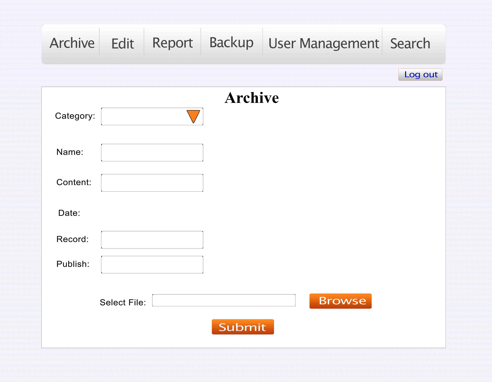
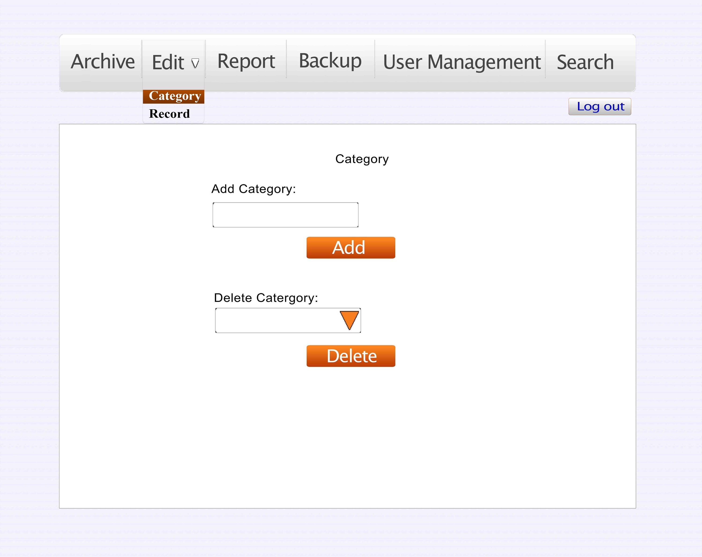
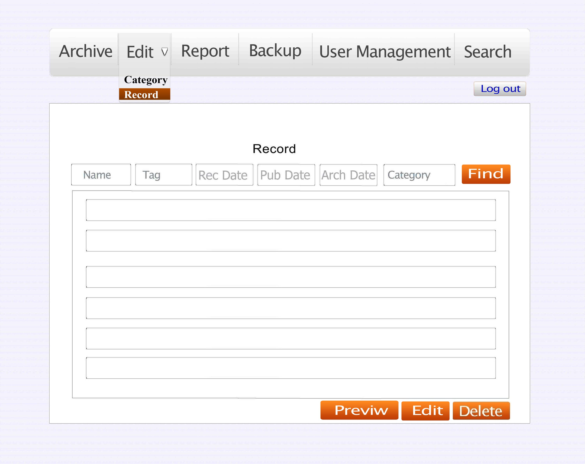
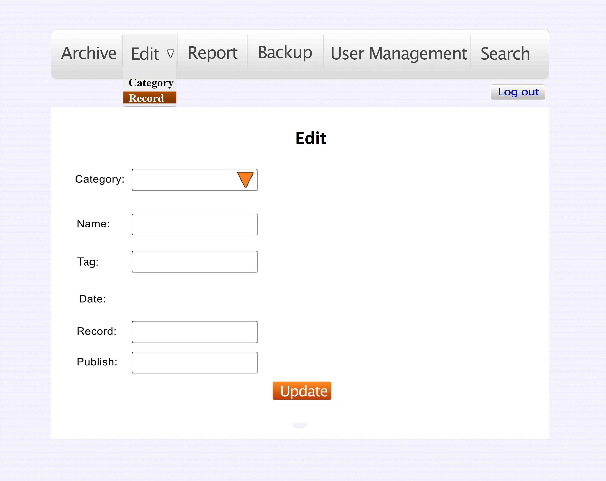
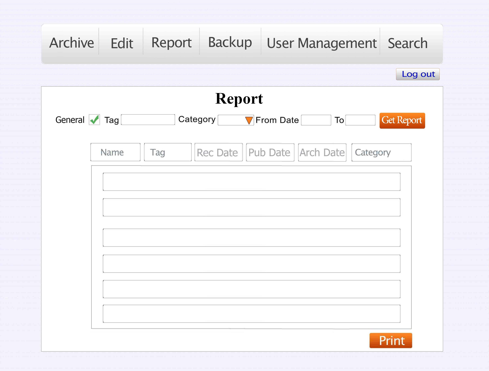
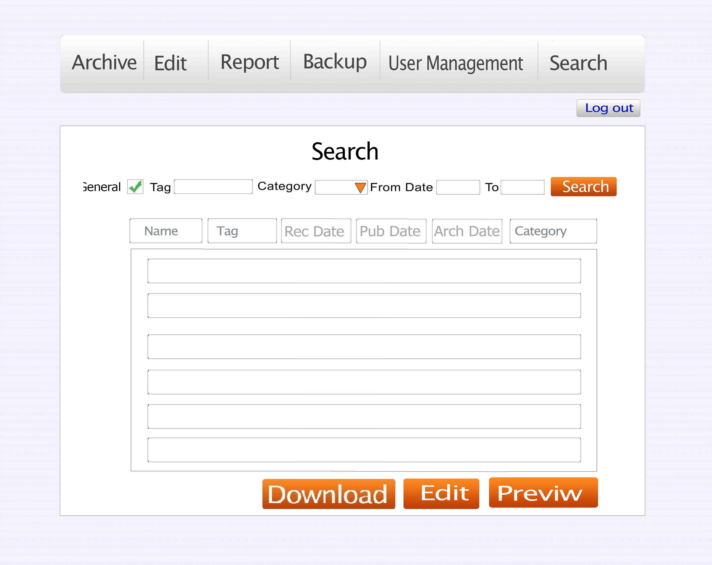
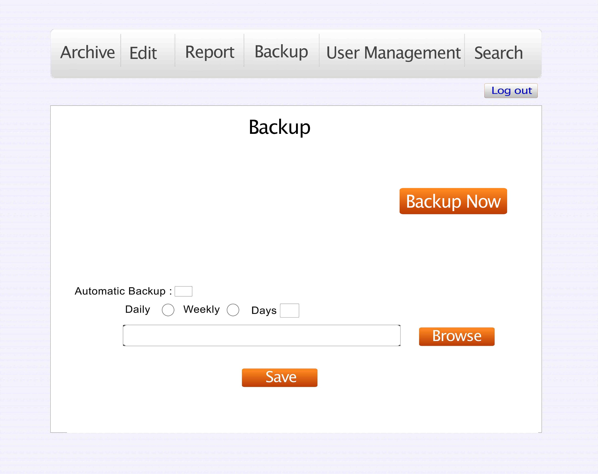
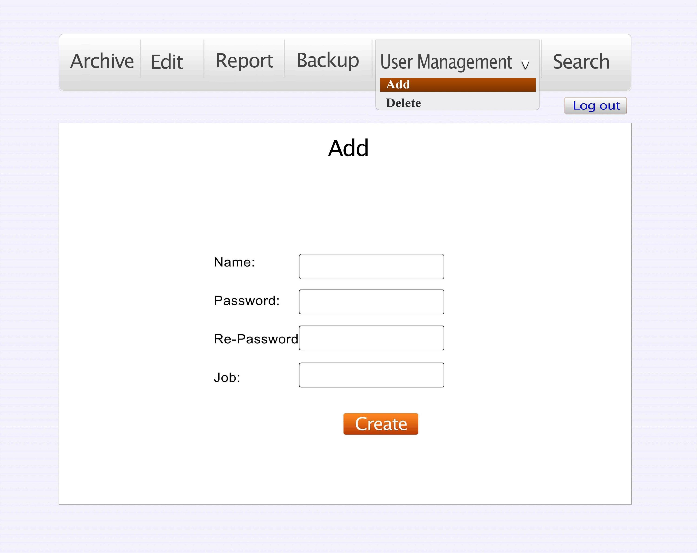
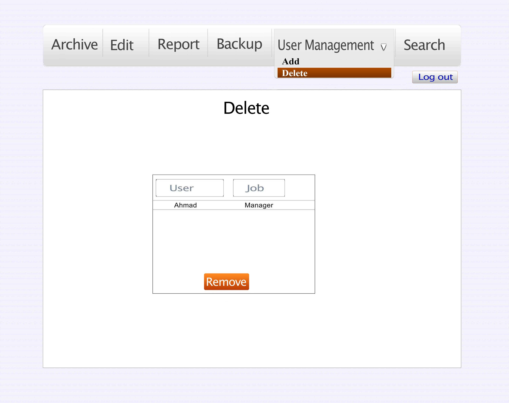

																786
       
THE ALPHA TEAM PROPOSAL FOR SERVICES
============================================

OVERVIEW
-----------------------------------------
 
The Alpha team is pleased to submit this proposal for services to support Eslaah TV in achieving its goals for improving their data management, Archiving and retrieving Data.

### The Objective ###

The customer's objectives are as following:

* < Need #1: managing data in an efficient  manner>
* < Need #2: Archiving data in an efficient manner >
* < Need #3: Retrieving Data in an easy way>
* < Need #4 :having a report of  data>
* < Need #5:  avoiding Redundancy and duplication in data.>
* < Need #6:Prevention of data-loss (Data Backup)>

### The Opportunity ###

As we have read the clients request for proposal, we recognized that their major goal is to have better data management in their archive. So we would like to grab this opportunity and offer our solution. We would like to summarize the client's goal based on their request for proposal.
 
* < Goal #1: to have a system that  manages their data better>
* < Goal #2: assure quick access to their data>
* < Goal #3: assure data loss prevention>

### The Solution ###

We as a team of experts in our field offer a logical recommendations to this problem. We can develop a software for you that can solve your problems and make efficient use of your time, energy and help you manage your archive better.

We offer these recommendations:

* < Recommendation #1: desktop based TV Archive Manager System>
* < Recommendation #2: web based TV Archive manger System(TAM)>

OUR PROPOSAL
------------------------

We are a team consisting of six people which can help you solve your problems and achieve your goals. Our team has the following members with their specific abilities.

1. Ahmad Jawid (Programmer & Software Engineer)
2. Fardin Hakimi (Software Engineer)
3. Ghazalle Zaheer (Database Designer)
4. Jalil Ahmad Fazely (Database Designer)
5. Aalem Daneshyar (Programmer)
6. Shah Agha (Programmer)

 We strongly recommend you the web based TV archive manger. Because it has the following advantages:

* Multiuser access to data.
* Better data management
* Accessing data over local network
* Ease of retrieving data
* Saves time and energy
* Better security over desktop based system.

 If you continue using the current way of archiving and managing your data, you are likely to face the following problems:

* Losing track of data
* High rate  of Data duplication
* High rate of losing data 
* Mismanagement of data
* Waste of time and energy
* Too much load of data
 
Our solution can enable Eslaah TV to fully realize the benefits of improved productivity throughout the use of our proposed system. Most importantly, we provide the training and support for this new solution.

### Rationale ###

Based on experience of other televisions in various parts of the world, traditional managing and archiving data is not a good idea. It is better to have a specific software to able to manage and archive data in an efficient manner.

### Execution Strategy ###

Our execution strategy incorporates proven methodologies, extremely qualified personnel, and a highly responsive approach to managing deliverables. Following is a description of our project methods, including how the project will be developed.

We will use the agile development method, and we will use two iterations to complete the whole project.

Iteration 1: 

* Archiving data capability
* Managing data capability

Iteration 2: 

* Quick access to data( retrieving capability)
* Having a report of data

### Project Deliverables ###

Following is a complete list of all project deliverables:

<table>
  <tr>
    <th>Deliverable</th><th>Description</th>
  </tr>
  <tr>
    <td>Archiving data </td><td>In categories.</td>
  </tr>
  <tr>
    <td>Archiving the categorized data</td><td>Based on record date, name, contents and a tag.</td>
  </tr>
<tr>
    <td>Report</td><td>Monthly, weekly or daily report of recorded programs.</td>
  </tr>
<tr>
    <td>Searching for a program </td><td>Based on name, date, category, tag or description.</td>
  </tr>
<tr>
    <td>Managing Data</td><td>View, Edit or delete data in different categories.</td>
  </tr>
<tr>
    <td>Redundancy and duplication control</td><td></td>
  </tr>
<tr>
    <td>Prevention of data-loss (Data Backup)</td><td></td>
  </tr>
</table>

### Timeline for Execution ###

Key project dates are outlined below. Dates are best-guess estimates and are subject to change until a contract is executed.

<table>
  <tr>
    <th> Description </th><th> Start Date </th><th> End Date </th> <th>Duration</th>
  </tr>
  <tr>
    <td> Project Start </td><td> 30/3/2013</td><td>22/6/2013</td><td>84 days </td>
  </tr>
  <tr>
    <td> Adding items by category </td><td>11-may-2013</td><td>16-May-2013</td><td>5 days </td>
  </tr>
  <tr>
    <td> Editing or deleting items </td><td>16-May-2013</td><td>23-May-2013</td><td>7 days </td>
  </tr>
  <tr>
    <td> First demo </td><td>11-may-2013</td><td>25-May-2013</td><td>14 days</td>
  </tr>
  <tr>
    <td> Report printing </td><td>25-May-2013</td><td>1-June-2013</td><td>7 days</td>
  </tr>
  <tr>
    <td> Search capability </td><td>1-June-2013</td><td>11-June-2013</td><td>10 days</td>
  </tr>
  <tr>
    <td>Second Demo</td><td>25-May-2013</td><td>19-June-2013</td><td>25 days</td>
  </tr>
  <tr>
    <td> Merge Branch to Release </td><td>19-June-2013</td><td>22-June-2013</td><td>3 days</td>
  </tr>
  <tr>
    <td> Project End </td><td>30/3/2013</td><td>22/6/2013</td><td>84 days</td>
  </tr>

</table>

EXPECTED RESULTS
-------------------------------

We expect our proposed solution to Eslaah TV's requirements to provide the following results:

### Financial Benefits ###

* <Result #1: Requires less resources
* <Result #2: Efficient usage of resources
* <Result #3: Increased productivity

### Technical Benefits ###

* <Result #1: Increased work agility>
* <Result #2: Easy data trouble shooting>
* <Result #3: Easy data management>
* <Result #4: increased work accuracy

CONCLUSION
-------------------------
 
We look forward to working with Eslaah TV and supporting your efforts to improve your Data management, and supporting the software. We are confident that we can meet the challenges ahead, and stand ready to partner with you in delivering an effective solution. 

If you have questions on this proposal, feel free to contact <Ahmad Jawed Jami > at your convenience by email at <AlphaTeam@gmail.com > .We will be in touch with you next week to arrange a follow-up conversation on the proposal.

Thank you for your consideration.

INTERVIEW 
====================

INTERVIEWED BY: THE ALPHA TEAM  

INTERVIEWEE: MR. ABDULLAHI 

To have a better understanding of the project requirements we (The Alpha Team) 
came out to have an interview with the technical staff of the Eslaah TV. 

<b>Fazil:</b> You mentioned that you've worked for different TV stations, did they use any 
database system? 

<b>Technician:</b> Unfortunately no. None of the TV stations, even now, don't have a 
database system. 

<b>Jawid:</b> Do you only want to save the link/address of a file in the database or the file 
itself? 

<b>Technician:</b> No I need just the address of the file but it would be great if there is a 
preview for the specified file in the interface, only if possible. 

<b>Fazel:</b> What about the backup do you need the files to be backed up? 

<b>Technician:</b> Yes of course; we need the files to be automatically backed up, by 
schedule. And the path for backup should be manually specified. 

<b>Technician:</b> What do you think should we have a database for each section (Archive, 
Production, Management, and Editing)? 

<b>Jawid:</b> We have a solution for that, however it's a bit difficult, but we want to create 
web-based application for you to be accessed on the network for each section of your 
station. 

<b>Aalem:</b> how do you archive your files? 

<b>Technician:</b> Based on date, the files are categorized in two parts: Broadcasted and 
Non-broadcasted program. In each folder the category of the files are specified and 
the files are archived. The categorized archived files are then burned on DVDs.
 
<b>Aalem:</b> Even after this system is completed, would you still keep on archiving data on 
DVDs as hard copy? 

<b>Technician:</b> No, this is just a temporary solution to avoid losing data. We want to store 
the data on Hard Drives only. 

We want the programs to be archived and retrieved with/by the following details: 

* Name 
* Dates (Recording, Publishing, Archiving) 
* Category 
* Contents (Tags) 
* Duration of program 

<b>Technician:</b> We also need to have the ability to add a new category. And user/data 
management. 

<b>Jawid:</b> What about the reporting? 

<b>Technician:</b> We do need this ability for the following reports  

* General 
* Specified period of time 
* Categorized 
* Tags 

#Statement of Work for Islaah TV #

The Alpha Team
================================

-------------------------
SOW for Agreement to Perform Consulting Services to Islaah TV
-------------------------
Date: March 30, 2013 
Services Performed By: The Alpha Team 
Services Performed To: Islaah TV 

-------------------------

This statement of work is agreed upon between the Alpha Team and Islaah TV. Only the 
requirements specified in this document are deliverable and will be fulfilled up till the specified 
date. 

Period of Performance 
================================

-------------------------

Start date March 30, 2013, and shall continue through June 22, 2013. 

Scope of Work 
================================

-------------------------
####Problem Statement: ####
Islaah TV uses the traditional/old system of management for archiving data, which is file based 
that will lead to the following problems: 

*  Archiving programs 
*  Categorizing data 
*  Editing or deleting data 
*  Data duplication 
*  Inefficient searching 
*  Waste of time 
*  waste of energy 

#### Our Solutions: ####

We develop an application, which is a database system by the name of Television Archive 
Manager (TAM). 
#### Deliverables: ####
These deliverables are specified according to the client's requirements;
Archiving data by category. 
*  Archiving the categorized data based on their record date, name, contents and a 
tag. 
*  Annually, monthly, weekly or daily report of recorded programs, in print version 
*  Searching for a program based on name, date, category, tag or description. 
*  View, Edit or delete data in different categories. 
*  Redundancy and duplication control 
*  Prevention of data-loss (Data Backup)  

The Alpha Team Responsibilities
================================
-------------------------
The team;s responsibility is to develop the application according to the client's requirements and 
to deliver it on time. To ensure the satisfaction of the client, quality of work and maintenance of 
the software. 

Client Responsibilities 
================================
-------------------------
Having regular meetings with the team and explaining the requirements as clear as possible and 
to support the project till the completion.

Timeline
================================
-------------------------
The project deliverables timeline table: 
<table>
  <tr>
    <th>Deliverable Name</th><th>Delivering Date</th><th>Number of Days</th>
  </tr>
  <tr>
    <td>Adding items by category</td><td>16-May-2013</td><td>5 </td>
  </tr>
 <tr>
    <td>Editing or deleting items </td><td>23-May-2013 </td><td>7</td>
  </tr>
<tr>
    <td>First demo</td><td>25-May-2013</td><td>14</td>
  </tr>
<tr>
    <td>Report printing </td><td>1-June-2013 </td><td>7</td>
  </tr>
<tr>
    <td>Search capability </td><td>11-June-2013</td><td>10</td>
  </tr>
<tr>
    <td>Second Demo </td><td>19-June-2013 </td><td>25</td>
  </tr>
<tr>
    <td>Merge Branch to Release</td><td>22-June-2013 </td><td>40</td>
  </tr>
</table>
Completion Criteria 
================================
-------------------------
* The Alpha Team is to deliver the project on the date specified in the timeline. 
* The specified requirements are to be fulfilled only. 

Assumptions
================================
-------------------------
* The completion of the project may be delayed if new requirements, based on the 
agreement of both parties, are added. 

Functional Requirement Specification
=====================================

1_ As an administrator or user I can access the database from a local/remote system

2_ As a user or administrator I can archive data based on

* Name
* Dates (Recording, Publishing)
* Category
* Contents (Tags)
* Duration of program

3_ As a user or administrator I can search data based on

* Name
* Dates (Recording, Publishing, Archiving)
* Category
* Contents (Tags)
	 
4_ As a user or administrator I can get report based on

* General
* Specified period of time
* Category
* Tags

5_ As an administrator I can back up the data manually or automatically by specified schedule

6_ As an administrator I can manipulate data

* Add a category
* Delete a category
* Edit a file 
* Delete a file
	
7_ As an administrator I can add new authorized users or remove existing ones    

#User Interface
Fig1: Login    
   
Fig2: Archive   
   
Fig3: Edit-1   
   
Fig4: Edit-2   
   
Fig5: Edit-3   
   
Fig6: Report   
   
Fig7: Search   
   
Fig8: Backup   
   
Fig9: User management-add    
   
Fig10: User management-delete   
   

<b>Note:</b> It's mentionable that all the tasks were done by all of the group members, not 
individually. Pushing into git-hub was given to a specific member. But coding will be 
done individually.
 
Thanks  

The Alpha Team 
